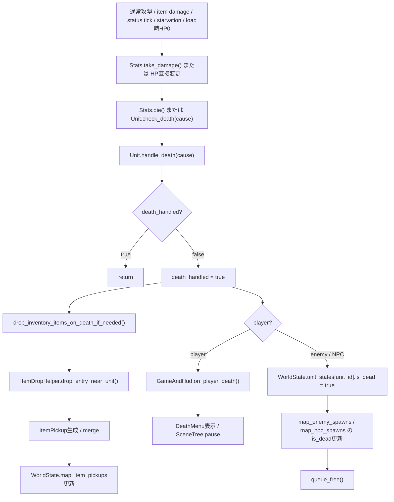

# Death Path Diagram

## このdocsの目的

このdocsは、UnitがHP0へ到達してから、死亡処理、死亡時drop、WorldState更新、player死亡UIへ進む現状経路を整理した地図です。

追跡対象:

- `Stats`
- `Unit`
- `CombatManager`
- `DamageCalculator`
- `ItemEffectManager`
- `ItemDropHelper`
- `Inventory`
- `WorldState`
- `SaveManager`
- `UnitSpawnManager`
- `ItemWorldManager`

目的は、二重death、二重drop、equipment drop漏れ、initial inventoryとdeath dropの混同を避けることです。将来の分割案、共通化案、drop table導入案を決めるdocsではありません。

## 全体図



`drop_inventory_items_on_death_if_needed()` は、drop tableを読みません。死亡時点でUnitが実際に持っているentryを集めます。

## 死亡処理に関わる主要スクリプト

### `scripts/core/unit.gd`

- `check_death(cause)` でHP0以下を確認します。
- `handle_death(cause)` が共通死亡処理です。
- `death_handled` で二重実行を防ぎます。
- bag / hotbar / equipmentからdrop対象を集めます。
- non-playerの死亡状態をWorldStateへ記録します。
- player死亡をGameAndHudへ通知します。
- status tick、starvation、offscreen status damageも扱います。

### `scripts/core/stats.gd`

- `take_damage(amount)` でHPを減らします。
- HP0以下なら `die()` を呼びます。
- `die()` は親Unitの `handle_death()` を直接呼びます。

### `scripts/combat/combat_manager.gd`

- 通常攻撃とbump attackを進行します。
- `DamageCalculator` の結果を `Stats.take_damage()` へ渡します。
- 通常攻撃後に装備攻撃効果を処理します。
- `perform_attack()` は最後に `target.check_death("attack")` も呼びます。

### `scripts/combat/damage_calculator.gd`

- 命中、critical、防御、属性・damage type補正を計算します。
- damage値を返す役割で、Unit死亡処理やdropは直接行いません。

### `scripts/item/item_effect_manager.gd`

- item effectの `deal_damage` をdispatchします。
- direct / calculated damageの両方で、可能なら `Stats.take_damage()` を使います。
- damage後に `target.check_death("item_effect_damage")` を呼びます。
- status effect自体はUnitEffectRuntimeとしてUnitへ追加します。

### `scripts/item/unit_effect_runtime.gd`

- status / modifierのdurationとtick accumulatorを保持します。
- runtime自身はUnitをdropしません。
- tickが発生した時のHP変更と死亡判定はUnit側が行います。

### `scripts/item/item_drop_helper.gd`

- Unit近傍の有効tileを探します。
- compatibleなstackable pickupが足元にあればmergeします。
- 新しいItemPickupを生成するか、既存pickupへ追加します。
- 処理後のmap内pickup一覧を `WorldState.map_item_pickups` へ保存します。

### `scripts/item/inventory.gd`

- bagとhotbarのentry配列を持ちます。
- death drop側からentry取得とsource slot clearに使われます。
- stack amountと `instance_data` を含むentryの保存・復元を担当します。

### `scripts/world/world_state.gd`

- `unit_states` にUnitのruntime保存状態を持ちます。
- `map_enemy_spawns` / `map_npc_spawns` にspawn個体の死亡状態を持ちます。
- `map_item_pickups` に地面のpickup状態を持ちます。
- map resetでは対象mapのspawn、pickup、unit stateを消す場合があります。

### `scripts/save_manager.gd`

- mapの `save_all_units()` を呼びます。
- `WorldState` の列挙済みpropertyをsave fileへsnapshotします。
- `unit_states`、enemy/npc spawn、`map_item_pickups` はsnapshot対象です。

### `scripts/managers/unit_spawn_manager.gd`

- saved enemy / NPCのspawn dataと `unit_states` に `is_dead=true` があれば再生成しません。
- saved Unitは保存済みinventoryを復元し、initial inventoryを再抽選しません。
- 新規random Unitでは古い同一IDのruntime stateを消します。

### `scripts/item/item_world_manager.gd`

- `WorldState.map_item_pickups[map_id]` からItemPickupを再生成します。
- map内pickupを `get_save_data()` で集めてWorldStateへ保存します。
- chestは `map_chests` で別管理し、Unit death dropとは混ぜません。

## 死亡に到達する主な入口

### 通常攻撃

主な経路:

```text
Player / AI Controller
-> CombatManager.perform_attack()
-> DamageCalculator.calculate_damage()
-> target.stats.take_damage(damage)
-> Stats.die()
-> Unit.handle_death()
```

`perform_attack()` は装備攻撃効果の処理後に `target.check_death("attack")` も呼びます。通常damageで既に `Stats.die()` が走っている場合、後段の呼び出しは `death_handled` により二重死亡処理になりません。

`try_bump_attack()` も `Stats.take_damage()` を使います。こちらは明示的な後段 `check_death()` を持ちませんが、Statsから死亡処理へ到達します。

通常攻撃でtargetが死亡した後:

- 装備攻撃 `deal_damage` と `apply_status` はtarget HPを見てskipします。
- 装備攻撃 `restore_resource` はattackerへのon-hit rewardなので、target死亡後も実行可能です。

### Item effect damage

主な経路:

```text
Inventory / hotbar / target item action
-> ItemEffectManager.apply_item_effects()
-> apply_single_effect()
-> _apply_deal_damage()
-> _apply_direct_deal_damage() または _apply_calculated_deal_damage()
-> Stats.take_damage()
-> target.check_death("item_effect_damage")
```

`Stats.take_damage()` が利用できないfallbackではHPを直接変更します。その場合も、後段の `check_death()` が共通死亡処理へ接続します。

### Status / runtime damage

on-map tick:

```text
Unitのeffect runtime進行
-> process_effect_ticks()
-> _apply_runtime_tick()
-> _apply_runtime_damage()
-> Stats.take_damage()
-> Unit.check_death("status_*")
```

offscreen elapsed:

```text
Unit.apply_offscreen_effect_elapsed()
-> poison / burning / frostbite の経過damageをHPへ反映
-> Unit.check_death("offscreen_status_*")
```

offscreen経路はHPを直接減らし、直後に `check_death()` を呼びます。

### Starvation

```text
Unit._apply_hunger_starvation_damage()
-> Stats.take_damage() またはHP直接変更
-> Unit.check_death("starvation")
```

### Load時HP0

non-player Unitは `load_persistent_stats()` で `WorldState.unit_states[unit_id]` を適用した後、`check_death("load")` を呼びます。

effect runtimeのoffscreen elapsed適用中に先に死亡へ到達した場合も、後続の `check_death("load")` は `death_handled` によって重複処理されません。

### Debug / direct kill

現在の `DebugSettings.gd` には、Unitを直接killする専用flagは確認できませんでした。

確認できたdeath関連DebugSettingsは、player死亡時のdrop対象scopeを切り替えるものです。これは死亡を発生させる機能ではありません。

## `Unit.handle_death()` の流れ

### 1. 二重death guard

最初に `death_handled` を確認します。

```text
death_handled == true
-> return
```

初回だけ `death_handled = true` とします。この代入はdrop処理より前です。

### 2. HPの正規化

Statsがある場合、HPを0以下へ寄せます。正数へ戻す処理ではありません。

### 3. Death drop

player / enemy / NPCの分岐より先に `drop_inventory_items_on_death_if_needed()` を呼びます。

したがって、drop flagが有効ならplayerもnon-playerも同じcollectorを通ります。

### 4. Player分岐

playerの場合:

- player死亡ログを出します。
- HUD status / effect表示を更新します。
- `_notify_player_death(cause)` が祖先をたどり、`GameAndHud.on_player_death()` を呼びます。
- GameAndHudはDeathMenuを表示し、SceneTreeをpauseします。
- `handle_death()` 内ではplayer nodeを `queue_free()` しません。
- non-player用の `unit_states.is_dead` / spawn data更新には進みません。

death dropでsource slotが消えた場合、`PlayerData.inventory_data` / `equipment_data` も更新されます。

### 5. Enemy / NPC分岐

non-playerの場合:

- `unit_id` があれば `get_stats_data()` を取得します。
- dataへ `is_dead=true` を追加し、`WorldState.unit_states[unit_id]` へ保存します。
- `_mark_spawn_data_dead()` が、該当する `map_enemy_spawns` と `map_npc_spawns` のentryを探して `is_dead=true` にします。
- 最後にUnit nodeを `queue_free()` します。

EnemyとNPCは、`handle_death()` 内では同じnon-player経路です。

### Active quest NPC / generated quest NPC

`handle_death()` にはactive quest NPCやgenerated quest NPCを死亡対象外にする専用分岐は確認できません。

WorldStateのmap reset処理にはactive quest Unit stateを消さない保護がありますが、これはreset時のstate clearing保護です。Unit死亡を防ぐ処理ではありません。

死亡時に `unit_generated_quests` を消す専用処理も `handle_death()` 内には確認できません。

## Death drop path

### 親flag

`drop_inventory_on_death=false` なら、bag / hotbar / equipmentをすべてskipします。

`drop_equipped_items_on_death=true` でも、親flagがfalseならequipmentは落ちません。

### Inventoryがない場合

`inventory == null` ならdrop処理を終了します。

### Drop対象収集

`_collect_inventory_drop_targets()` が次を集めます。

- `Inventory.get_all_items()` のbag entry。
- `Inventory.get_all_hotbar_items()` のhotbar entry。
- `drop_equipped_items_on_death=true` の場合、`equipment_slot_order` にある装備entry。

空item IDまたはamount 0以下のentryは除外します。

bag、hotbar、equipmentはそれぞれ別sourceとして扱います。同じ `item_id` が複数sourceに実在する場合、sourceごとのentryがdrop候補です。

### Entry保持

collectorはentryを `duplicate(true)` します。

`ItemDropHelper` の正規化後に保持する主な値:

- `item_id`
- `amount`
- 非空の `instance_data`

enchant付きequipment等の `instance_data` は深い複製でItemPickupへ渡ります。

### 配置

`death_inventory_drop_radius` は `max(1, value)` によりruntimeで最低1へ補正されます。

各entryについて:

```text
ItemDropHelper.drop_entry_near_unit(entry, unit, radius)
-> 成功: source slotをclear
-> 失敗: source slotを残し、failed_countを増やす
```

先にsourceを消してからdropする構造ではありません。配置成功後だけ元slotをclearします。

### Dropしない条件

- `death_handled` 済みで `handle_death()` がreturn。
- `drop_inventory_on_death=false`。
- Unitのinventoryがnull。
- 対象entryが空。
- ItemDropHelperがmap root、GroundLayer、ItemPickups、pickup scene、有効tile等を確保できない。
- equipmentは `drop_equipped_items_on_death=false` の場合。

ItemDropHelper失敗時は元sourceをclearしません。

### Enemy / NPC TSV設定

`EnemyData` / `NpcData` が持つ設定:

- `drop_inventory_on_death`
- `drop_equipped_items_on_death`
- `death_inventory_drop_radius`

GameDataRegistryの空欄default:

- `drop_inventory_on_death`: `true`
- `drop_equipped_items_on_death`: `true`
- `death_inventory_drop_radius`: `5`

調査時点のmaster data:

- enemies 39件: すべて `true / true / 5`
- npcs 3件: すべて `true / true / 5`

`apply_enemy_data()` / `apply_npc_data()` がこれらをUnitへ反映します。

## `ItemDropHelper` との関係

### Drop context

Unitから親をたどり、GroundLayerとItemPickupsを持つmap rootを探します。

必要なruntime参照:

- GroundLayer
- WallLayer
- Units
- ItemPickups
- item pickup scene
- map ID
- origin Unit / origin tile

これらのnode参照はその場の配置処理に使うだけで、save dataへ保存しません。

### 足元への配置とmerge

- entryがstack可能で、同じitemのcompatible pickupが足元にあればmergeします。
- `instance_data` 付きentryはstackしません。
- equipment entryはstackしません。
- 足元に別pickupがある場合は周辺の空tileを探します。
- GroundLayer外、WallLayer上、別pickup上、blocking Unit上は避けます。
- origin Unit自身は足元判定時だけ許容します。

### Pickup生成

新しいpickup:

```text
item_pickup_scene.instantiate()
-> ItemPickupsへadd_child()
-> ItemPickup.setup_with_entry()
```

`setup_with_entry()` はentryをdeep copyします。`ItemPickup.get_save_data()` はentryにtile座標を加えて返します。

### WorldState更新

dropまたはmerge成功後、ItemPickups nodeの全childを `get_save_data()` で集めます。

```text
WorldState.map_item_pickups[map_id] = current pickup list
```

保存するのはDictionary化されたpickup状態です。ItemPickup node参照は保存しません。

## WorldState / Save / Loadとの関係

### 死亡Unit状態

non-player死亡時:

- `WorldState.unit_states[unit_id]["is_dead"] = true`
- `WorldState.map_enemy_spawns[map_id]` の該当entryをdead化
- `WorldState.map_npc_spawns[map_id]` の該当entryをdead化

UnitSpawnManagerはsaved spawnを読む時、spawn dataまたはunit stateがdeadならそのUnitを生成しません。

### Death drop pickup

death drop成功時:

- map内にItemPickup nodeが生成またはmergeされます。
- `WorldState.map_item_pickups[map_id]` が直ちに現在一覧へ更新されます。
- map再訪問時、ItemWorldManagerがこの一覧からpickupを再生成します。

### SaveManager snapshot

`SaveManager.WORLD_STATE_PROPS` に含まれるdeath関連state:

- `unit_states`
- `map_enemy_spawns`
- `map_npc_spawns`
- `map_item_pickups`
- `map_chests`

save時には可能ならcurrent mapの `save_all_units()` を先に呼び、その後WorldStateをsnapshotします。

### Saved Unitとinitial inventory

Unit data適用時、`_has_saved_inventory_state()` が `WorldState.unit_states[unit_id]` にinventoryを見つけると、initial inventoryを生成しません。

その後 `load_persistent_stats()` / `apply_stats_data()` が保存済みinventoryとequipmentを復元します。

したがって、同じsaved Unitをloadするたびにinitial inventoryが再抽選される経路ではありません。

### Map reset

WorldStateのregenerable map resetは、対象mapのenemy spawn、pickup、chest、Unit state等を消す場合があります。active quest NPCについては一部state / NPC spawnを保護します。

このdocsはreset後に同種Unitを再生成する仕様や期間バランスまでは扱いません。詳しくは [map_spawn_persistence_deep_dive.md](map_spawn_persistence_deep_dive.md) を参照してください。

## Initial inventory / Death drop / Drop tableの違い

### `initial_inventory_tables.tsv` / `initial_inventory_entries.tsv`

- Unit spawn時の初期所持品生成ルールです。
- entryごとにspawn chanceとamountを決め、Unit本体inventoryへ追加します。
- saved inventoryがあるUnitでは再抽選しません。
- 死亡時専用loot tableではありません。

### Death drop

- 死亡時点でUnitが実際に持つentryを落とします。
- bagとhotbarが対象です。
- equipmentはflagにより対象です。
- inventoryに存在しないitemは落ちません。
- 死亡時にinitial inventory tableを再抽選しません。

### `drop_tables.tsv`

- 現状は存在しません。
- このStepでも作成しません。
- drop-only reward tableが必要かどうかはStep 12以降の別フェーズです。

## Shop / Chest / Tradeとの境界

### Chest

ChestはUnitではなく、自身の `Chest.inventory` を持ちます。

- Chest.inventoryはUnit death collectorの対象ではありません。
- chest stateは `WorldState.map_chests` へ保存されます。
- InventoryUIでside inventoryとして見えていても、Unit death dropには入りません。

### Trade side inventory

InventoryUIの `trade_inventory` / `trade_unit` はUI session中の参照です。

- death collectorはInventoryUIのside参照を走査しません。
- trade/chest UI modeやheld item sourceからdrop対象を作りません。
- scene node参照をWorldStateへ保存しません。

### Merchant / shop inventoryの現状

用途としてはmerchantの売り物です。一方、現コードでは:

- trade sideには `merchant_unit.inventory` が渡されます。
- `Unit.apply_shop_inventory_from_data()` はshop itemをUnitの `inventory` へ追加します。
- UnitSpawnManagerのshop inventory生成もUnitのInventoryへloadします。
- death collectorはentryの生成由来を見ず、死亡Unitの `inventory` を集めます。

したがって、現状コードには「shop由来entryだけをdeath dropから除外する」専用判定は確認できません。merchant Unitが死亡し、`drop_inventory_on_death=true` なら、そのUnit.inventory内に実在するshop stockもcollector上は候補です。

これは改善案ではなく、現在の物理的な保存先とcollectorの事実です。Chest.inventoryやInventoryUIのside参照をUnit.inventoryと同一視する、という意味ではありません。

## Player / Enemy / NPCの違い

### Player死亡

- enemy/NPCと同じdeath drop collectorを先に通ります。
- DebugSettingsが有効ならdrop scopeをplayer限定で上書きできます。
- drop成功後はPlayerDataのinventory / equipmentを更新します。
- playerの `unit_states.is_dead` やmap spawn dataは更新しません。
- player nodeは `handle_death()` 内でqueue_freeされません。
- GameAndHudがDeathMenuを表示し、SceneTreeをpauseします。
- continue時はSaveManagerの保存済み状態をloadする経路です。

### Enemy死亡

- bag / hotbar / equipmentをflagに応じてdropします。
- `unit_states` とenemy spawn dataをdead化します。
- Unit nodeをqueue_freeします。
- saved spawn時はdead stateにより再生成されません。

### NPC死亡

- `handle_death()` 上はenemyと同じnon-player経路です。
- `unit_states` とNPC spawn dataをdead化し、queue_freeします。
- active quest / generated questを理由に死亡をskipする分岐は確認できません。
- merchant inventoryの現在の保存先はUnit.inventoryなので、shop由来を自動除外するdeath collectorは確認できません。

## 二重death / 二重drop防止

### `death_handled`

`Unit.handle_death()` 冒頭のguardが中心です。

初回:

```text
death_handled = true
-> death drop
-> player / non-player後処理
```

2回目以降:

```text
handle_death()
-> return
```

### StatsとUnitの重複判定

`Stats.take_damage()` はHP0で `Stats.die()`、そこから `Unit.handle_death()` を呼びます。

その後、呼び出し側が `Unit.check_death()` を呼ぶ経路があります。

- `CombatManager.perform_attack()`
- `ItemEffectManager` damage helpers
- Unitのstarvation / status処理
- load時HP0

これらは同じframeで重なる場合がありますが、`death_handled` によりdropは初回だけです。

### Equipment attack effect

通常攻撃damageで既にtargetが死亡した場合:

- additional `deal_damage`: HP0判定でskip。
- `apply_status`: HP0判定でskip。
- `restore_resource`: attackerが生存していればon-hit rewardとして実行可能。

追加damage自体がtargetを死亡させた場合も `Stats.take_damage()` から共通death pathへ進みます。

### Source slot clear

二重drop防止はdeath guardだけではありません。

- drop成功後だけsource slotをclearします。
- drop失敗時はsource entryを残します。
- bag / hotbar / equipmentはsource種別ごとにclearします。

`dropped_count` はdrop成功したentry数であり、stack内のitem総数ではありません。

## DebugSettings / debug logとの関係

### Player death drop scope

`DebugSettings`:

- `debug_player_death_drop_scope_test_enabled = false`
- `debug_player_death_drop_scope_mode = "all"`

enabled時だけplayer Unitへ適用します。

mode:

- `none`: `drop_inventory_on_death=false`
- `inventory_only`: bag + hotbar、equipmentなし
- `all`: bag + hotbar + equipment
- 未定義値: `all`

`apply_debug_player_death_drop_scope_if_needed()` はplayer Unitの `_ready()` から、persistent state読込後に呼ばれます。

scope debug時の主なlog:

- `[DEATH DROP SCOPE]`
- `[DEATH DROP SCOPE RESULT]`
- `[DEATH DROP] skipped by drop_inventory_on_death=false`

### DebugSettings外の出力

次のような出力はdeath scope flagとは別です。

- Statsのdamage / death print。
- Unitの `[DEATH]` / `[DEATH DROP]` print。
- ItemEffectManagerのdamage print。
- status tick / offscreen tick print。
- SaveManagerのnon-player save debug出力。

`DamageCalculator` の詳細計算logには `debug_damage_calculate` がありますが、death/drop scopeとは別flagです。

このStepではDebugSettings値を変更していません。

## よくある誤解・注意点

- death dropはdrop tableではありません。
- `initial_inventory_*` はspawn時所持品であり、死亡時loot tableではありません。
- saved Unitではinitial inventoryを再抽選しません。
- death dropは死亡時点でUnitが実際に持つbag / hotbar / equipmentから出ます。
- equipmentは `drop_equipped_items_on_death` に従います。
- `drop_inventory_on_death=false` は全dropを止めます。
- Chest.inventoryはUnit death drop対象ではありません。
- InventoryUIのtrade/chest side参照はdeath collectorの対象ではありません。
- merchant shop stockは概念上は売り物ですが、現コードではmerchant Unit.inventoryに入るため、由来別のdrop除外はありません。
- scene node参照は保存しません。
- pickupやUnit死亡状態等、保存する状態はDictionary化してWorldStateへ置きます。
- source slotはpickup配置成功後にclearします。
- DebugSettings値はこのStepでは変更しません。
- `drop_tables.tsv` / `drop_table_entries.tsv` は作りません。
- 今回は現状理解docsです。death処理分割やdrop table導入判断はStep 12以降です。

## 変更・確認時に見る場所

死亡入口:

- `scripts/core/stats.gd`
  - `take_damage()`
  - `die()`
- `scripts/core/unit.gd`
  - `check_death()`
  - `handle_death()`

通常攻撃死亡:

- `scripts/combat/combat_manager.gd`
  - `try_bump_attack()`
  - `perform_attack()`
- `scripts/combat/damage_calculator.gd`
  - `calculate_damage()`

Item effect damage:

- `scripts/item/item_effect_manager.gd`
  - `apply_item_effects()`
  - `apply_single_effect()`
  - `_apply_deal_damage()`

Status / starvation damage:

- `scripts/core/unit.gd`
  - `_apply_runtime_damage()`
  - `apply_offscreen_effect_elapsed()`
  - `_apply_hunger_starvation_damage()`
- `scripts/item/unit_effect_runtime.gd`

Death drop:

- `scripts/core/unit.gd`
  - `drop_inventory_items_on_death_if_needed()`
  - `_collect_inventory_drop_targets()`
  - `_clear_inventory_drop_target()`
- `scripts/item/item_drop_helper.gd`

Inventory / hotbar / equipment:

- `scripts/item/inventory.gd`
- `scripts/core/unit.gd`
  - `equipment_slot_order`
  - `get_equipped_item_entry()`
  - `clear_equipment_slot()`

WorldState / save / restore:

- `scripts/world/world_state.gd`
- `scripts/save_manager.gd`
- `scripts/managers/unit_spawn_manager.gd`
- `scripts/item/item_world_manager.gd`

Player死亡UI:

- `scripts/core/unit.gd`
  - `_notify_player_death()`
- `scripts/hud/game_and_hud.gd`
  - `on_player_death()`
  - `_show_death_menu()`
- `scripts/death_menu.gd`

DebugSettings / logs:

- `scripts/debug/DebugSettings.gd`
- `scripts/core/unit.gd`
  - `apply_debug_player_death_drop_scope_if_needed()`
  - `_debug_log_death_drop_scope_targets()`
  - `_debug_log_death_drop_scope_result()`
- [debug_settings_deep_dive.md](debug_settings_deep_dive.md)

## 関連docs

- [death_drop_spec.md](death_drop_spec.md)
- [unit_combat_death_system_deep_dive.md](unit_combat_death_system_deep_dive.md)
- [unit_lifecycle_deep_dive.md](unit_lifecycle_deep_dive.md)
- [data_spawn_save_system_deep_dive.md](data_spawn_save_system_deep_dive.md)
- [save_worldstate_playerdata_map.md](save_worldstate_playerdata_map.md)
- [map_spawn_persistence_deep_dive.md](map_spawn_persistence_deep_dive.md)
- [trade_chest_ownership_deep_dive.md](trade_chest_ownership_deep_dive.md)
- [debug_settings_deep_dive.md](debug_settings_deep_dive.md)

## このdocsで分かること / 分からないこと

### 分かること

- 死亡に到達する主な入口。
- `Unit.handle_death()` 周辺の流れ。
- death dropがどのentryから出るか。
- initial inventoryとdeath dropの違い。
- player / enemy / NPC死亡時の大まかな違い。
- WorldState / save / loadとの関係。
- 二重death / 二重drop防止の入口。
- 確認時に見るコード入口。

### 分からないこと

- 将来どこを分割するべきか。
- death pathを共通化するべきか。
- drop tableを導入するべきか。
- player死亡drop仕様を本番でどうするべきか。
- death / drop全体を再設計するべきか。
- merchant shop stockとUnit.inventoryの所有権を将来どう分けるべきか。

これらはStep 12以降の別フェーズです。
