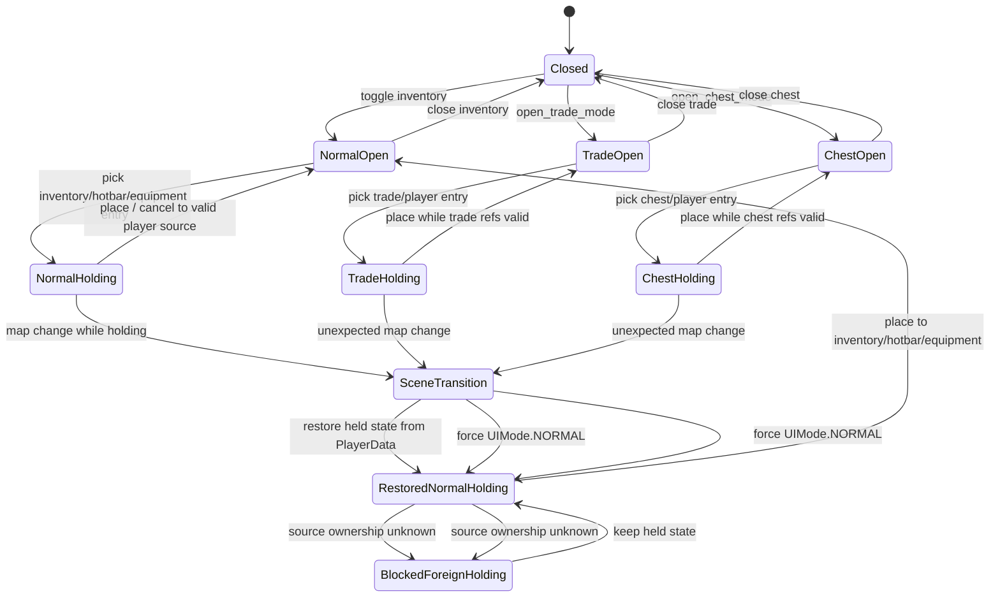

# InventoryUI State Transition

このdocsは、`InventoryUI` の `UIMode` と held item state を混同しないための状態遷移図です。

`InventoryUI` は通常inventory、trade、chest、equipment、hotbar、held item、scene跨ぎ復元を扱うため状態が複雑です。今後変更するときは、「UIがどのmodeか」と「持ち上げ中itemがどこ由来か」を分けて考えます。

## UIMode一覧

| UIMode | 意味 | side panel | 移動可否 | scene跨ぎ時の扱い |
| --- | --- | --- | --- | --- |
| `UIMode.NORMAL` | 通常inventory。bag / hotbar / equipment を操作する | なし | 可 | 通常modeとして再表示可能。held itemは `PlayerData` から復元する。 |
| `UIMode.TRADE` | player inventory と merchant inventory の売買画面 | merchant inventory | 不可 | modeは持ち越さない。新sceneではnormalへ正規化する。 |
| `UIMode.CHEST` | player inventory と chest inventory の出し入れ画面 | chest inventory | 不可 | modeは持ち越さない。新sceneではnormalへ正規化する。 |

## held item state一覧

| 状態 | 置き場所 | 意味 | scene跨ぎするか | 注意 |
| --- | --- | --- | --- | --- |
| `held_entry` | `InventoryUI` | 現在カーソル/選択中に持ち上げているentry本体 | 直接はしない | `item_id` だけではなくentry全体を保持する。 |
| `held_from_area` | `InventoryUI` | 持ち上げ元のarea。`inventory` / `hotbar` / `equipment` / `trade` など | `PlayerData`へ同期 | UIModeとは別概念。 |
| `held_from_index` | `InventoryUI` | 持ち上げ元slot index | `PlayerData`へ同期 | equipment由来では `-1` のことがある。 |
| `held_from_slot_name` | `InventoryUI` | equipment slot名 | `PlayerData`へ同期 | `right_hand`、`body`、`accessory_1` 等。 |
| `PlayerData.held_inventory_entry` | `PlayerData` | scene跨ぎ用のheld entry複製 | する | `duplicate(true)` で `instance_data` を守る。 |
| `PlayerData.held_inventory_source_area` | `PlayerData` | scene跨ぎ用source area | する | `trade` / `chest` 相当は所有権に注意。 |
| `PlayerData.held_inventory_source_index` | `PlayerData` | scene跨ぎ用source index | する | 元参照がfree済みなら戻せない。 |
| `PlayerData.held_inventory_source_slot_name` | `PlayerData` | scene跨ぎ用equipment slot名 | する | equipment復元時に使う。 |
| `PlayerData.held_inventory_previous_ui_mode` | `PlayerData` | scene遷移前のUI mode名 | する | 前回が特殊modeでも新sceneではnormalへ戻す判断材料。 |

## area/source一覧

| source | 所有者 | 実体の置き場所 | scene跨ぎ時 | 配置/キャンセル時の注意 |
| --- | --- | --- | --- | --- |
| `inventory` | player / Unit | `Inventory.items` | source情報は保持可能 | 元slotが空なら戻す。無理なら空きbagへ戻す。 |
| `hotbar` | player / Unit | `Inventory.hotbar_items` | source情報は保持可能 | hotbar元slotが空なら戻す。無理ならhotbar空きまたはbagへ戻す。 |
| `equipment` | Unit | `Unit.equipped_items` | source情報は保持可能 | slotに置ける装備か確認する。無理ならbagへ戻す。 |
| `trade` | merchant / side inventory | `InventoryUI.trade_inventory` | entry/source情報だけ保持。参照は持ち越さない | 所有権不明なら無条件にplayer bagへ入れない。 |
| `chest` | chest / side inventory | `Chest.inventory`。UI上はside inventory | entry/source情報だけ保持。参照は持ち越さない | chest node referenceが無効なら配置を拒否してheld維持。 |

## 状態遷移図

## 通常inventory中の流れ

1. `GameAndHud.toggle_inventory_ui()` から通常inventoryを開きます。
2. `InventoryUI` は `UIMode.NORMAL` になります。
3. bag / hotbar / equipment のitemを持ち上げます。
4. `held_entry` と source情報が `PlayerData.held_inventory_*` に同期されます。
5. scene移動が発生した場合、古い `InventoryUI` は `_exit_tree()` でheld stateを保持します。
6. 新しいsceneの `InventoryUI` はnormal modeとして開き、`restore_held_state_from_player_data()` でheld itemを復元します。
7. 復元後は通常inventory / hotbar / equipmentへ配置できます。

通常inventory modeは移動をロックしません。持ち上げたまま移動・scene移動できることが仕様です。

## trade/chest中の流れ

1. `open_trade_mode()` または `open_chest_mode()` で特殊modeを開きます。
2. trade/chest中は `PlayerController.is_ui_locked()` 経由で移動不可です。
3. itemを持ち上げた場合、held entryは通常と同じく `PlayerData` へ同期されます。
4. 万一scene移動が発生した場合、`UIMode.TRADE` / `UIMode.CHEST` は持ち越しません。
5. 新sceneでは `normalize_to_normal_inventory_mode()` 相当でnormalへ正規化します。
6. held item自体は消しません。
7. 元の `trade_inventory` / `trade_unit` / chest node reference は持ち越しません。
8. sourceがtrade/chest由来で所有権が不明な場合は、player bagへ無条件に入れず、配置を拒否してheld stateを保持します。

## scene跨ぎ時に持ち越すもの / 持ち越さないもの

| 対象 | 持ち越すか | 理由 |
| --- | --- | --- |
| `held_entry` | 持ち越す | item消失を防ぐため。entry全体を保持する。 |
| `held_from_area` | 持ち越す | cancel/placement時のsource判断に必要。 |
| `held_from_index` | 持ち越す | 元slotへ戻せるか判定するため。 |
| `held_from_slot_name` | 持ち越す | equipment slot由来の復元に必要。 |
| `previous_ui_mode` | 持ち越す | 前回が特殊modeだった場合にnormalへ正規化するため。 |
| `current_inventory` | 持ち越さない | scene内Unit/Inventory参照はfreeされる可能性がある。 |
| `current_unit` | 持ち越さない | Unit node参照はscene切替で無効になる可能性がある。 |
| `trade_inventory` | 持ち越さない | merchant/chest側参照はfree済みになる可能性がある。 |
| `trade_unit` | 持ち越さない | merchant Unit node参照はscene切替で無効になる可能性がある。 |
| Chest node reference | 持ち越さない | Chest nodeはmap scene配下でfree対象。 |
| merchant Unit reference | 持ち越さない | merchant Unit nodeはmap scene配下でfree対象。 |

## 禁止事項

- scene跨ぎで `trade_inventory` / `trade_unit` / chest node reference を `PlayerData` に保存しない。
- held itemを `item_id` だけで保存しない。entry全体を保持する。
- `instance_data` を落とさない。
- trade/chest由来のheld itemを無条件にplayer bagへ入れない。
- 通常inventory中の移動を誤ってロックしない。
- `UIMode` と `held_from_area` を混同しない。
- 特殊modeをscene跨ぎで維持しない。

## InventoryUI変更時の確認リスト

- 通常inventoryを開く/閉じる。
- bag内移動。
- hotbar移動。
- equipment装備/解除。
- item use。
- world drop / discard。
- held itemを持ったままscene移動。
- scene移動後にheld itemを配置できる。
- trade中は移動不可。
- chest中は移動不可。
- trade売買。
- chest出し入れ。
- trade/chest由来held itemが不正配置されない。
- `previously freed` エラーが出ない。
- item消失がない。
- `instance_data` 付き装備が保持される。

## 関連docs

- [inventory_trade_chest_system_deep_dive.md](inventory_trade_chest_system_deep_dive.md)
- [ui_input_scene_transition_deep_dive.md](ui_input_scene_transition_deep_dive.md)
- [../architecture/subsystem_interaction_map.md](../architecture/subsystem_interaction_map.md)
