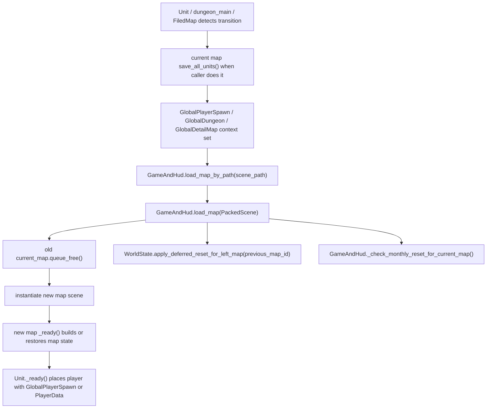

# Map Spawn / Persistence Deep Dive

## 目的

このdocsは、map scene scriptsを中心に、map生成、scene遷移、enemy/NPC spawn、item/chest spawn、WorldState保存、reset/regenerationの関係を整理するための地図です。

新しいmap、spawn rule、保存対象、reset対象を追加するときは、先にこのdocsで「どのmap種別の話か」「保存済み状態を優先するのか」「新規生成してよいのか」を確認してください。

Godot上でmap遷移やWorldState復元を確認する時は [../checklists/save_load_regression_matrix.md](../checklists/save_load_regression_matrix.md) を使います。

## Map種別の概要

| 種別 | 主なscript | 主な役割 | 主な保存先 | 注意 |
| --- | --- | --- | --- | --- |
| Field map | `scripts/map/map_scene_scripts/FiledMap.gd` | 広域field、dungeon入口、special place生成、月次/world resetの実行地点 | `WorldState.map_tile_data`, `field_dungeon_entrances`, `field_special_places` | 実ファイル名は `FiledMap.gd`。typoに見えるが現状の参照名なので不用意に変更しない。 |
| Detail map | `scripts/map/map_scene_scripts/main.gd` | fieldから入る詳細map。tile生成、enemy/NPC spawn、item/chest spawn | `WorldState.field_detail_map_data`, `map_tile_data`, `map_enemy_spawns`, `map_npc_spawns`, `map_item_pickups`, `map_chests` | `GlobalDetailMap.current_detail_map_key` がある場合、それを `map_id` にする。 |
| Dungeon floor | `scripts/dungeon/dungeon_main.gd` | dungeon階層。floor data、stairs、enemy/NPC spawn、item/chest spawn | `WorldState.dungeon_data`, `dungeon_floor_data`, `map_tile_data`, `map_enemy_spawns`, `map_npc_spawns`, `map_item_pickups`, `map_chests` | `map_id = current_dungeon_id + "_floor_" + current_floor`。dungeon内でglobal dungeon dataを雑に消さない。 |
| Unique / special map | `FiledMap.gd` -> `GlobalDetailMap` -> detail map系scene | field上の特殊地点から入る固有map | `WorldState.unique_map_instances`, `field_detail_map_data`, detail mapと同じmap state | 固有mapはreturn contextを持つ。reset時も通常detail mapと少し扱いが違う。 |
| Simple biome map | `grass_map.gd`, `forest_map.gd`, `beach_map.gd`, `sea_map.gd` | 古い/簡易detail系map。exportされた敵/NPC list/countでspawn | `map_tile_data`, `map_enemy_spawns`, `map_npc_spawns` | `main.gd` より簡易。item/chest managerは基本持たない。 |
| Start field | `start_field.gd` | 開始用map。enemy/NPCとitem/chest saveを持つdetail寄りmap | `map_enemy_spawns`, `map_npc_spawns`, `map_item_pickups`, `map_chests` | detail mapとfield mapの中間的な古い入口。 |

## Map Scene Scripts責務比較

| Script | Tile生成/復元 | Enemy/NPC spawn | Item/Chest spawn | Scene遷移 | Reset/Regeneration | 備考 |
| --- | --- | --- | --- | --- | --- | --- |
| `FiledMap.gd` | `WorldState.map_tile_data` を優先し、なければfield map生成 | 基本なし | 基本なし | dungeon入口、special place入口、field復帰 | FieldMap上で月次/world reset、NPC reset、dungeon入口再生成を処理 | field全体の司令塔。 |
| `main.gd` | `GlobalDetailMap` / `WorldState.field_detail_map_data` を使ってdetail mapを生成/復元 | `unit_spawn_rules.tsv` と `EnemyData/NpcData` からpoolを作る | `ItemWorldManager.setup_detail_map_random_spawn_with_save()` | 主にUnit側のtransitionから読み込まれる | map自体はWorldState reset対象 | 詳細mapの標準実装。 |
| `dungeon_main.gd` | `WorldState.dungeon_floor_data` と `map_tile_data` を使う | `dungeon_spawn_rules.tsv` 優先、なければ通常fallback | `ItemWorldManager.setup_dungeon_floor_random_spawn_with_save()` | 階段で上下階/fieldへ遷移 | dungeon resetはFieldMap帰還後に実体化 | floor単位の保存とrepair処理がある。 |
| `start_field.gd` | 既存tileを使う簡易map | saved/random spawn | `ItemWorldManager.setup_detail_map_random_spawn_with_save()` | 通常のmap sceneとして読み込まれる | 特別なreset処理は薄い | 開始map用。 |
| `grass_map.gd` / `forest_map.gd` / `beach_map.gd` / `sea_map.gd` | 既存/生成tileを保存復元 | export list/countでsaved/random spawn | 基本なし | 通常のmap sceneとして読み込まれる | 特別なreset処理は薄い | `main.gd` へ統一する場合は別Stepで慎重に。 |

## Map Load / Scene Transition Flow

### 基本の流れ

### 役割の切り分け

| 場所 | 役割 |
| --- | --- |
| `Unit.try_move()` / transition helpers | tile event、dungeon入口、detail map入口を検出し、必要なら `map_root.save_all_units()` を呼んでから遷移contextをセットする。 |
| `dungeon_main.gd` | stairs遷移時に `save_all_units()` し、`GlobalDungeon.current_floor` と `pending_spawn_stair_type` を更新する。 |
| `FiledMap.gd` | dungeon/special place入口を生成し、入る時に `GlobalDungeon` / `GlobalDetailMap` / `GlobalPlayerSpawn` をセットする。 |
| `GameAndHud.load_map_by_path()` | scene pathをPackedSceneにloadして `load_map()` に渡す。 |
| `GameAndHud.load_map()` | 古いmap nodeをfreeし、新しいmap sceneをinstantiateする。load後のplayer位置補正、left map deferred reset、monthly reset確認もここ。 |
| `GlobalPlayerSpawn` | 次sceneでplayerを置く一時tile。save snapshotには含めない。 |
| `PlayerData.map_positions` | save/load後のplayer位置復元用。map_idごとの最後のtileを持つ。 |

`GameAndHud.load_map()` 自体は古いmapの `save_all_units()` を常に呼ぶ場所ではありません。現在は、Unit遷移処理やdungeon stairs処理など、遷移を開始する側が必要に応じて先に保存します。

## Enemy / NPC Spawn Flow

### Detail map

1. `main.gd` が `GlobalDetailMap.current_detail_map_key` や `field_detail_map_data` から `map_id` / generator / difficulty を決める。
2. `unit_spawn_rules.tsv` を `SpawnRuleData` として参照し、`spawn_generator_tags`、difficulty、rule条件でenemy/NPC poolを作る。
3. `WorldState.map_enemy_spawns[map_id]` があれば `UnitSpawnManager.spawn_saved_enemies()` を使う。
4. 保存済みspawnがなければ `spawn_random_enemies()` で新規生成し、spawn listを `WorldState.map_enemy_spawns` に保存する。
5. NPCも同様に `map_npc_spawns` を優先する。

### Dungeon floor

1. `dungeon_main.gd` が `GlobalDungeon.current_dungeon_id/current_floor` から `map_id` を作る。
2. `WorldState.dungeon_floor_data[map_id]` がなければfloor dataを作る。
3. `dungeon_spawn_rules.tsv` からfloor/theme/layout/difficultyに合うruleを探す。現在ruleがない場合でもfallbackでenemy configを作る。
4. 保存済み `map_enemy_spawns/map_npc_spawns` があれば復元し、なければrandom spawnする。
5. 古い保存データでenemy count/typeが空ならrepairしてfloor dataへ戻す処理がある。

### UnitSpawnManager

| 関数 | 役割 | 保存/復元の注意 |
| --- | --- | --- |
| `spawn_random_enemies()` / `spawn_enemy_random()` | random enemyを作り、`enemy_data_to_apply` を渡してadd_childする | 新規random Unitは同じunit_idの古いruntime stateを `clear_runtime_state_for_new_random_unit()` で消す。 |
| `spawn_saved_enemies()` | `WorldState.map_enemy_spawns[map_id]` からenemyを復元 | spawn dataや `WorldState.unit_states[unit_id].is_dead` がdeadなら生成しない。 |
| `spawn_random_npcs()` / `spawn_npc_random()` | random NPCを作り、add_child後に `apply_npc_data()` を呼ぶ | shop inventory生成もここから絡む。 |
| `spawn_saved_npcs()` | `WorldState.map_npc_spawns[map_id]` からNPCを復元 | active quest NPC保護とresetが絡むため、NPC spawn listを雑に消さない。 |

Enemyは `enemy_data_to_apply` をUnitへ渡して `_ready()` 内で `apply_enemy_data()` されます。NPCは `UnitSpawnManager` からadd_child後に `apply_npc_data()` を直接呼ぶ経路があります。この差は保存/initial inventoryを触るときの重要な注意点です。

## Initial Inventoryとの関係

- `EnemyData` / `NpcData` は `initial_inventory_table_id` から展開された `initial_inventory_items` を持つ。
- 新規Unit生成時、保存済みinventoryがない場合だけ `Unit.apply_initial_inventory_from_data()` が実行される。
- `spawn_chance` はUnit生成時の所持品生成確率であり、死亡時の再抽選ではない。
- 保存済みUnitでは `WorldState.unit_states` のinventoryを復元し、initial inventoryを再抽選しない。
- 死亡時dropはUnitが実際に持っているbag/hotbar/equipmentを落とす方式で、`drop_tables.tsv` / `drop_table_entries.tsv` は存在しない。

## Item / Chest Spawn Flow

| 領域 | 主な入口 | 保存済み優先 | 新規生成 | 保存先 |
| --- | --- | --- | --- | --- |
| Detail item pickup | `ItemWorldManager.setup_detail_map_random_spawn_with_save()` | `WorldState.map_item_pickups[map_id]` があればそれをload | `spawn_rules.tsv` / category multiplier / item overrideからroll | `WorldState.map_item_pickups` |
| Detail chest | `setup_detail_map_random_spawn_with_save()` | `WorldState.map_chests[map_id]` があればそれをload | `chest_tables.tsv` / `chest_loot_tables.tsv` またはfallbackから生成 | `WorldState.map_chests` |
| Dungeon item pickup | `setup_dungeon_floor_random_spawn_with_save()` | 同上 | dungeon contextで `spawn_rules.tsv` をroll | `WorldState.map_item_pickups` |
| Dungeon chest | `setup_dungeon_floor_random_spawn_with_save()` | 同上 | final floorならtreasure寄り、それ以外は0-1個生成 | `WorldState.map_chests` |
| Shop inventory | Unit/NPC/shop logic | merchant/shop state側 | shop tables/fallback | 本体inventoryとは別 |

`ItemWorldManager` は、map初回訪問時だけ `WorldState.map_item_pickups/map_chests` を生成し、以後は保存済み配列からnodeを再生成します。pickupは `setup_with_entry(data.duplicate(true), map_id, tile)` を使うため、装備instance dataも保存済みentryに残せます。

Shop inventoryはmap上pickup/chest生成とは別です。merchantの売り物とUnit本体inventoryを混ぜないでください。

## Saved State Priority

| 対象 | 優先順位 |
| --- | --- |
| Map tile | `WorldState.map_tile_data[map_id]` があればload。なければmap scene scriptが生成してsave。 |
| Detail map config | `GlobalDetailMap` のcurrent値、または `WorldState.field_detail_map_data[map_id]` を使う。なければ作る。 |
| Dungeon floor config | `WorldState.dungeon_floor_data[map_id]` を使う。なければ `_ensure_floor_data_exists()` で作る。 |
| Enemy/NPC | `WorldState.map_enemy_spawns/map_npc_spawns` があればsaved spawnを復元。なければrandom spawn。deadはskip。 |
| Unit stats/inventory | `WorldState.unit_states[unit_id]` があればそれを復元。なければdata TSV適用とinitial inventory。 |
| Item/Chest | `WorldState.map_item_pickups/map_chests` があればload。なければrandom生成してWorldStateへ保存。 |
| Player position | load時は `PlayerData.map_positions/current/last` を `GameAndHud` が見る。scene遷移直後は `GlobalPlayerSpawn` が優先される場面がある。 |

## WorldState対応表

| WorldState key | 主なwriter | 主なreader | 内容 |
| --- | --- | --- | --- |
| `map_tile_data` | map scene `save_map_tiles()` | map scene `load_map_tiles()` | ground/wall/event layerのtile状態。 |
| `map_enemy_spawns` | `UnitSpawnManager.spawn_enemy_random()`, death mark | `spawn_saved_enemies()` | mapごとのenemy spawn list。 |
| `map_npc_spawns` | `UnitSpawnManager.spawn_npc_random()`, death mark | `spawn_saved_npcs()` | mapごとのNPC spawn list。 |
| `unit_states` | `Unit.save_persistent_stats()`, death handling | `Unit.load_persistent_stats()`, `UnitSpawnManager` | HP、inventory、equipment、effects、dead stateなど。 |
| `map_item_pickups` | `ItemWorldManager.save_item_pickups_to_world_state()`, initial item generation, death drop | `ItemWorldManager.load_item_pickups_from_world_state()` | map上pickupのentry/tile。 |
| `map_chests` | `ItemWorldManager.save_chests_to_world_state()` | `load_chests_from_world_state()` | chest_id/type/tile/opened/inventory。 |
| `field_detail_map_data` | `FiledMap.gd`, `main.gd` | `main.gd`, reset処理 | detail mapのgenerator/difficulty/context。 |
| `field_dungeon_entrances` | `FiledMap.gd` | `FiledMap.gd` | field上のdungeon入口群。 |
| `field_special_places` | `FiledMap.gd` | `FiledMap.gd` | field上のspecial place群。 |
| `unique_map_instances` | `WorldState.ensure_unique_map_instance()` | `FiledMap.gd`, `GlobalDetailMap` | unique/special mapのinstance context。 |
| `dungeon_data` | Field dungeon entrance flow | `dungeon_main.gd` | dungeon全体のtheme/difficulty/floor数など。 |
| `dungeon_floor_data` | `dungeon_main.gd` | `dungeon_main.gd` | floorごとのlayout、enemy config、bottom判定など。 |

## Reset / Regeneration

| Reset種別 | 実行/予約場所 | 消すもの | 残す/保護するもの |
| --- | --- | --- | --- |
| New game reset | `WorldState.reset_for_new_game()` | world/map/unit/pickup/chest/dungeon/quest reset state全般 | なし。PlayerDataは別途reset。 |
| Monthly / world reset | `WorldState.run_monthly_world_reset(active_map_id, month_index)` | regenerable detail/dungeon/unique mapのtile, enemy spawn, pickups, chests,一部unit state | FieldMap上でだけ実体化。active quest NPCがいるmapはNPC spawn/detail configを守る。 |
| Deferred map reset | `WorldState.apply_deferred_reset_for_left_map(left_map_id)` | deferred対象mapのみ | dungeon全体resetはここでは消さず、FieldMapまで保留。 |
| NPC reset | `WorldState.run_npc_reset_if_needed(index)` | generated quest cache、NPC trade inventory state | `reset_active_generated_quests_on_world_reset=false` なのでactive generated quest NPCは保護。 |
| Field dungeon regeneration | `FiledMap.gd` + `WorldState.clear_field_dungeon_global_data_for_regeneration()` | `dungeon_map_data`, `dungeon_floor_data`, `dungeon_data`, `field_dungeon_entrances` | `should_regenerate_field_dungeons` が立ったあと、FieldMap load時に実行。 |
| Detail map regeneration | world resetでWorldState側のmap stateを消す | tile/spawn/item/chest等 | unique mapはunit stateを残す例外あり。 |

現状、map regenerationはONの設計です。ただしdungeon関連のglobal dataはdungeon内で即消しせず、FieldMapに戻ってから安全に消すようになっています。

## Field / Detail / Dungeon差分

| 観点 | Field (`FiledMap.gd`) | Detail (`main.gd`) | Dungeon (`dungeon_main.gd`) |
| --- | --- | --- | --- |
| map_id | export値。通常 `FieldMap` | `GlobalDetailMap.current_detail_map_key` 優先 | `current_dungeon_id + "_floor_" + current_floor` |
| 生成対象 | 広域field、dungeon入口、special place | detail tile, enemy/NPC, pickup/chest | floor tile, enemy/NPC, pickup/chest, stairs |
| spawn rule | 入口/special place生成が中心 | `unit_spawn_rules.tsv` | `dungeon_spawn_rules.tsv` + fallback |
| item/chest | 基本なし | `ItemWorldManager` | `ItemWorldManager` |
| player spawn | dungeon/specialからの戻り位置を扱う | `GlobalPlayerSpawn` / player start | `pending_spawn_stair_type` で階段付近 |
| reset | 月次/world/NPC/dungeon regenerationの実行地点 | WorldStateから消される対象 | FieldMapに戻った後のreset対象 |
| 危険点 | `FiledMap.gd` のファイル名変更、resetをfield外で実行 | saved stateを無視してrandom生成し直す | dungeon dataを階層遷移中に消す |

## 変更判断テーブル

| やりたいこと | まず見る場所 | 変更候補 | 触らない方がよい場所 |
| --- | --- | --- | --- |
| detail mapの敵候補を変える | `unit_spawn_rules.tsv`, `enemies.tsv`, `main.gd` | TSV rule/data。必要ならspawn pool helper | `UnitSpawnManager` のsaved復元優先順 |
| dungeon floorの敵候補を変える | `dungeon_spawn_rules.tsv`, `dungeon_main.gd` | dungeon spawn rule追加 | `WorldState.dungeon_floor_data` の既存repairを壊す変更 |
| map上item/chest生成を変える | `spawn_rules.tsv`, chest table系, `ItemWorldManager` | TSV設定、最小helper追加 | shop inventoryやdeath drop |
| 新しいmap sceneを追加する | 既存map scene scripts, `GameAndHud` | scene scriptに `map_id`, `save_all_units()`, tile save/load, spawn/load優先を用意 | Autoloadにnode参照を保存する設計 |
| reset対象を増やす | `WorldState.reset_for_new_game()`, `clear_regenerable_map_data()` | WorldState keyの追加とsave snapshot対象 | active quest NPC保護を飛ばすclear |
| player位置復元を変える | `GlobalPlayerSpawn`, `PlayerData.map_positions`, `GameAndHud` | one-shot spawnとsaved positionを分ける | `GlobalPlayerSpawn` をsave fileに入れる変更 |

## 禁止・注意

- `drop_tables.tsv` / `drop_table_entries.tsv` は、drop-only rewardが必要になるまで追加しない。
- initial inventoryはspawn時の所持品生成であり、死亡時dropの再抽選ではない。
- saved `WorldState.map_enemy_spawns/map_npc_spawns` があるmapで、勝手にrandom spawnを追加しない。
- `map_item_pickups/map_chests` があるmapで、再訪問時にrandom生成し直さない。
- shop inventoryとUnit本体inventoryを混ぜない。
- `FiledMap.gd` は実ファイル名。renameはscene/script参照を巻き込むので別Stepにする。
- map scene node、Chest node、InventoryUI nodeなどscene内node参照は保存しない。保存するならDictionary化してPlayerData/WorldStateへ。
- dungeon resetをdungeon階層遷移中に即実行しない。FieldMap上で安全に実体化する。

## 確認チェックリスト

Map spawn/persistenceを触ったら、最低限以下を確認します。

- `py tools/validate_master_data.py`
- `git diff --check`
- 新規map初回訪問でtile/enemy/NPC/item/chestが生成される
- 同じmap再訪問で保存済みstateが復元され、再抽選されない
- enemyを倒した後、再訪問でdead enemyが復活しない
- pickup取得/chest開封後、再訪問で状態が戻らない
- initial inventoryは新規Unit生成時だけ適用され、保存済みUnitでは再抽選されない
- FieldMap帰還時のmonthly/world resetでdetail/dungeon stateが期待通り更新される
- active quest NPCがいるmapでNPC spawnが消えない
- dungeon階層移動で `dungeon_data/dungeon_floor_data` が消えない
- `test_training_slime` やsample/test系が通常spawnへ混ざらない

## 気になる点 / Backlog

- map scene scriptsに `save_map_tiles()`, `load_map_tiles()`, `save_all_units()`, saved/random spawn優先処理が複数あります。共通化候補ですが、field/detail/dungeonで例外が多いため、すぐに抽象化しない方が安全です。
- `FiledMap.gd` はファイル名がtypoに見えます。renameするならscene参照、docs、autoload連携をまとめて確認する専用Stepが必要です。
- simple biome scripts (`grass_map.gd` など) は `main.gd` より古い/簡易のspawn構造です。将来統一するなら、item/chest永続化やspawn rule対応の有無を先に棚卸ししてください。
- `dungeon_spawn_rules.tsv` はcode pathがある一方、データが少ない/空でもfallbackが動く設計です。rule追加時はfloor data repairと既存saveの互換性を確認してください。

## Quest NPC保護メモ

Quest lifecycleの詳細は [quest_generated_lifecycle_deep_dive.md](quest_generated_lifecycle_deep_dive.md) を参照します。

Regenerable mapやNPC resetを触る時は、active quest NPCを消さないことを優先します。

| 処理 | Questとの関係 |
| --- | --- |
| `WorldState.clear_regenerable_map_data()` | `WorldState.quest_active_data` からactive quest Unit IDを集め、該当NPC spawn/detail configを残す。 |
| `WorldState._clear_unit_states_for_map()` | protected active quest Unit IDはunit state削除対象から外す。 |
| `WorldState.reset_generated_npc_quest_state()` | `reset_active_generated_quests_on_world_reset=false` の場合、active quest NPCのgenerated cacheを残す。 |
| `UnitSpawnManager.clear_runtime_state_for_new_random_unit()` | 新規random Unit生成時に古いgenerated quest cacheを引き継がない。 |

Map spawn/persistenceを変更したStepでは、active generated questを受けたNPCがmap reset後も報告先として残るかを確認してください。
