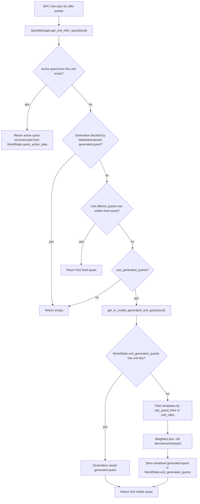

# Quest / Generated Quest Lifecycle Deep Dive

Step 11-H 時点の Quest / generated quest / NPC quest lifecycle の現状理解メモです。仕様変更やリファクタ案ではなく、今後の開発で「どこを見れば何が分かるか」を迷わないための地図として使います。

## 目的

- `QuestManager` / `QuestBoardManager` / `DialogueManager` / `Unit` / `WorldState` の分担を整理する。
- fixed quest と generated quest の入口、保存、reset、UI表示の流れを整理する。
- NPCが出すクエストが、map reset / NPC reset / save-load をまたいで壊れないための保護点を明記する。
- 新しい quest type や quest UI を追加するときに、触る場所と触らない場所を判断しやすくする。

今回はコード、TSV、仕様は変更しない。

## Subsystems

| Subsystem | 主なファイル | 主な責務 | 状態の置き場 | 注意点 |
| --- | --- | --- | --- | --- |
| Quest template registry | `scripts/data/game_data_registry.gd`, `scripts/data/quest_data.gd`, `scripts/data/quest_database.gd` | `quests.tsv` を `QuestData` に読み、lookupする | `GameData.quests` | runtime進行状態は持たない。 |
| NPC quest links | `scripts/data/game_data_registry.gd`, `data/master/npc_quest_links.tsv` | `npc_type_id -> quest_id` の候補制限/重み付け | `GameData.npc_quest_links_by_npc` | linkがあるNPCは、role filteringよりlink候補が優先される。 |
| QuestManager | `scripts/managers/quest_manager.gd` | offer取得、generated quest生成、受注、完了、失敗、掲示板用entry生成 | `WorldState.quest_*`, `WorldState.unit_generated_quests` | 実状態はWorldState側。QuestManagerは操作窓口。 |
| Dialogue | `scripts/managers/dialogue_manager.gd`, `scripts/unit_interaction_logic.gd`, `scripts/dialogue_ui.gd` | NPC会話を開き、actionをUnitへ渡し、依頼UI文脈を作る | DialogueManager内の一時状態 | quest action本体は主に `UnitInteractionLogic`。 |
| Quest board | `scripts/managers/quest_board_manager.gd`, `scripts/object/questboard/quest_board.gd`, `scripts/object/questboard/quest_board_ui.gd` | 掲示板を開き、NPC由来questを一覧表示し、受注/完了を呼ぶ | UI一時状態 | board独自のquest stateは持たない。 |
| Unit / NPC data apply | `scripts/core/unit.gd`, `scripts/managers/unit_spawn_manager.gd`, `scripts/data/npc_data.gd` | NPC/Enemy TSVの会話、role、request、dialogue dataをUnitへ適用 | Unit node / WorldState unit state | NPC nodeを消すとactive questの報告先が壊れるため、WorldState側に保護がある。 |
| WorldState | `scripts/world/world_state.gd` | quest進行、generated quest cache、reset保護、map state保存 | Autoload `WorldState` | generated quest resetとactive quest NPC保護の中心。 |
| SaveManager | `scripts/save_manager.gd` | WorldStateのquest系snapshotを保存/復元 | save file | `quest_active_data`, `quest_completed_data`, `quest_failed_data`, `unit_generated_quests` が保存対象。 |
| StatusUI | `scripts/hud/status_ui.gd` | active quest一覧、進捗、報酬、破棄ボタン表示 | UI一時状態 | `QuestManager.get_active_quest_list()` を読むだけ。 |
| Inventory | `scripts/item/inventory.gd` | 納品アイテムの所持数判定、消費、報酬追加 | UnitのInventory | 現状の完了可能objectiveは `DELIVER_ITEM`。 |

## Quest Types

| 種類 | 現状の実体 | 入口 | 保存/進行 | 備考 |
| --- | --- | --- | --- | --- |
| Fixed quest | `QuestData` をUnitの `offered_quests` に持たせる経路 | NPC会話、掲示板 | 受注後は `WorldState.quest_active_data` | `get_unit_offer_quests()` は fixed quest が見つかると1件だけ返す。 |
| Generated quest | `quests.tsv` のtemplateから `QuestManager` が生成する `generated__...` quest | NPC会話、掲示板 | 生成候補は `WorldState.unit_generated_quests`、受注後は `quest_active_data` | 1 NPCにつき最大1件に丸められる。 |
| NPC generated quest | NPCの `unit_id` / `npc_type_id` をキーに生成されるquest | `UnitInteractionLogic._get_primary_quest()` | `giver_unit_id` と generated quest id にUnit keyが入る | active中のNPCはresetから保護する必要がある。 |
| Quest board quest | 掲示板が周辺/linked Unitのofferを集めたentry | `QuestBoard.open_board()` | QuestManagerに委譲 | board専用データではない。NPC questの別表示。 |
| Delivery / collect-like quest | `QuestData.ObjectiveType.DELIVER_ITEM` | NPC/boardから受注 | 完了時にInventoryから必要数を消費 | kill/count/escort等は現状未実装。collect風の依頼も実装上は納品。 |

## TSV / Data Relationship

| TSV / Data | 主な列/field | 読み込み先 | 主な利用箇所 | 注意 |
| --- | --- | --- | --- | --- |
| `data/master/quests.tsv` | `quest_id`, `objective_type`, `objective_item_id`, `candidate_item_ids`, `candidate_categories`, `amount_min/max`, `time_limit_seconds`, `reward_gold`, `reward_item_ids`, `allowed_unit_role_flags`, `weight` | `GameDataRegistry._load_quests()` -> `QuestData` | `QuestDatabase`, `QuestManager` | `objective_type` は現状 `DELIVER_ITEM` / `NONE`。 |
| `data/master/npc_quest_links.tsv` | `npc_type_id`, `quest_id`, `weight`, `enabled` | `GameDataRegistry._load_npc_quest_links()` | `QuestManager._get_linked_quest_templates_for_unit()` | linkがあるNPCはlink候補を使う。 |
| `data/master/npcs.tsv` | `npc_type_id`, `dialogue_set_id`, `unit_roles`, `can_offer_request`, request text, shop fields | `GameDataRegistry._load_npcs()` -> `NpcData` | `Unit.apply_npc_data()` | quest templateそのものは持たない。linkとroleで候補が決まる。 |
| `dialogue_sets.tsv` / `dialogue_lines.tsv` | `dialogue_set_id`, context, text key | `GameDataRegistry._load_dialogue_sets/_load_dialogue_lines()` | Dialogue系 | Quest actionの詳細組み立ては `UnitInteractionLogic` 側。 |
| `QuestData` | template/objective/reward/text/role/weight | Resource | QuestManager | generated questではtitle/description/objective/rewardが確定値に変換される。 |
| `NpcData` | talk, role, request, shop, initial inventoryなど | Resource | UnitSpawnManager, Unit | `can_offer_request` は読み込まれるが、現状のrequest action表示は主に `_get_primary_quest(unit)` の有無で決まる。 |
| Validator | `tools/validate_master_data.py` | TSV検証 | export後の確認 | `npc_quest_links` の参照、dialogue参照、quest参照を検証する。 |

## Quest Generation Flow

Important ordering:

1. Active quest from the same Unit is returned first.
2. Failed/abandoned generated quest can block regeneration until NPC reset.
3. Fixed `offered_quests` wins before generated quests.
4. Generated quests are cached in `WorldState.unit_generated_quests` so they do not reroll every UI open.
5. Current code clamps generated offer count to max 1 per NPC.

## NPC and Quest Link

| Step | File / function | What happens |
| --- | --- | --- |
| NPC TSV load | `GameDataRegistry._load_npcs()` | `NpcData` gets `npc_type_id`, `unit_roles`, `can_offer_request`, `dialogue_set_id`, request text. Current action visibility still depends mainly on available quest data. |
| Link TSV load | `GameDataRegistry._load_npc_quest_links()` | `npc_quest_links_by_npc[npc_type_id]` stores enabled quest candidates and weights. |
| NPC spawn | `UnitSpawnManager` | Creates a Unit and calls `Unit.apply_npc_data(npc_data)`. |
| Data apply | `Unit.apply_npc_data()` | Copies talk/request/role/shop/death-drop fields and initial inventory into Unit. |
| Dialogue open | `DialogueManager.open_unit_dialog()` | Calls `target_unit.build_talk_context()`. |
| Talk context | `Unit.build_talk_context()` | Delegates actions to `UnitInteractionLogic.build_actions()`. |
| Request action | `UnitInteractionLogic.can_offer_request_to_player()` | Calls `_get_primary_quest(unit)`, which calls `QuestManager.get_unit_offer_quests(unit)`. |

Active quest NPCs must not be casually reset because active quest data stores `giver_unit_id`, and generated quest ids also embed the Unit key. If reset deletes the NPC spawn or its generated quest cache, the player may keep an active quest but lose a stable report target. `WorldState` therefore protects active quest Unit IDs during regenerable map clearing and generated quest reset.

## Acceptance Flow

| Entry point | Flow | Result |
| --- | --- | --- |
| NPC dialogue | `DialogueManager.open_unit_dialog()` -> `Unit.handle_interact_action("request")` -> `UnitInteractionLogic._build_request_detail_dialog()` -> `quest_accept_confirm` -> `QuestManager.accept_quest()` | `WorldState.quest_active_data[quest_id]` is created. |
| Quest board | `QuestBoard.open_board()` -> `QuestBoardManager.open_board()` -> `QuestBoardUI.reload_entries()` -> `QuestManager.get_board_quests()` -> `QuestManager.accept_quest_from_board()` | Same active data path. |
| Fixed quest | `Unit.offered_quests` if present and visible | Fixed template is accepted as-is. |
| Generated quest | `QuestManager.get_or_create_generated_unit_quests()` | Rolled quest is accepted after it has been cached. |

`QuestManager.can_accept_quest()` currently rejects:

- empty/null quest
- already active/completed/failed quest
- active quest count at `MAX_ACTIVE_QUESTS`
- another active quest from the same giver Unit

## Progress / Complete / Reward Flow

| Phase | File / function | What happens |
| --- | --- | --- |
| Progress check | `QuestManager.can_complete_quest()` | For `DELIVER_ITEM`, asks player `Inventory.can_consume_total_amount_ignore_instance(item_id, amount)`. |
| Complete from NPC | `UnitInteractionLogic._complete_primary_quest_and_rebuild()` | Calls `QuestManager.complete_quest(quest.quest_id, player_unit)`. |
| Complete from board | `QuestBoardUI._execute_selected_action()` | Calls `QuestManager.complete_quest_from_board()`. |
| Consume objective | `QuestManager.complete_quest()` | Calls `Inventory.consume_total_amount_ignore_instance()`. |
| Reward | `QuestManager.complete_quest()` | Adds `gold` item if it exists; otherwise uses `PlayerData.gold` fallback if present. Adds reward items to Inventory. |
| UI refresh | `QuestManager.complete_quest()` | Calls `player_unit.notify_inventory_refresh()` when available. |
| State move | `QuestManager.complete_quest()` | Moves active data into `WorldState.quest_completed_data`. |

Current objective support is narrow by design: completion logic only has a real path for `QuestData.ObjectiveType.DELIVER_ITEM`.

## WorldState Fields

| Field | Owner | Saved by SaveManager | Purpose | Reset notes |
| --- | --- | --- | --- | --- |
| `quest_active_data` | `WorldState` | yes | Active accepted quests, keyed by `quest_id` | Preserved across normal save/load. New game clears. |
| `quest_completed_data` | `WorldState` | yes | Completed quest history | Generated completed history is cleared by NPC generated reset. |
| `quest_failed_data` | `WorldState` | yes | Failed/abandoned quest history | Failed generated quests block regeneration until reset. |
| `unit_generated_quests` | `WorldState` | yes | Per-Unit generated quest cache before/while offered | NPC reset can clear non-active generated cache. |
| `npc_quest_generation_blocked_until_reset` | `WorldState` | no, as of current `SaveManager.WORLD_STATE_PROPS` | Temporary block after failed/abandoned generated quest | Cleared by NPC reset rules. Treat as runtime reset state unless SaveManager is updated. |
| `reset_npc_generated_quests_on_world_reset` | `WorldState` | no | Whether NPC reset clears generated quests | Default true. |
| `reset_active_generated_quests_on_world_reset` | `WorldState` | no | Whether active generated quests are also cleared | Default false; keep active generated quests. |

## Save / Load Relationship

- `SaveManager.WORLD_STATE_PROPS` includes `quest_active_data`, `quest_completed_data`, `quest_failed_data`, and `unit_generated_quests`.
- QuestManager does not keep separate persistent dictionaries; it reads/writes WorldState.
- Generated quests that were rolled but not accepted can be restored because `unit_generated_quests` is saved.
- Accepted quests are restored from `quest_active_data`; board/NPC UIs reconstruct display entries from that data when possible.
- `npc_quest_generation_blocked_until_reset` is present in WorldState but is not in current SaveManager snapshot props. Do not assume it survives a full save/load without verifying the intended spec.

## Reset Relationship

| Reset / clear | Current behavior | Quest-specific protection |
| --- | --- | --- |
| New game | `WorldState.reset_for_new_game()` clears quest active/completed/failed/generated/block dictionaries. | Full reset. |
| Regenerable map clear | `WorldState.clear_regenerable_map_data()` clears map state. | `_collect_active_quest_unit_ids()` protects active quest Unit states and NPC spawns. |
| NPC generated quest reset | `WorldState.reset_generated_npc_quest_state()` | Clears generation blocks, clears non-active generated quest cache, erases generated completed/failed records. |
| Active generated quest reset | Controlled by `reset_active_generated_quests_on_world_reset`. | Default false, so active generated quest NPCs are kept. |
| Random Unit replacement | `UnitSpawnManager.clear_runtime_state_for_new_random_unit()` erases `WorldState.unit_generated_quests[unit_id]`. | Prevents a new random Unit instance from inheriting stale generated offer cache. |

`reset_active_generated_quests_on_world_reset=false` is important: if `quest_active_data` stays but `unit_generated_quests` and NPC spawn state disappear, the player can end up with an active generated quest whose giver cannot be found from the UI.

## UI Display Relationship

| UI | Data source | Actions | Notes |
| --- | --- | --- | --- |
| NPC dialogue | `QuestManager.get_unit_offer_quests(unit)` | accept / complete / back | Built through `UnitInteractionLogic`, not only `DialogueManager`. |
| Quest board | `QuestManager.get_board_quests(linked_unit_ids, player_unit)` | accept / complete / close | If linked IDs are empty it scans units group; active board quests are appended from WorldState when needed. |
| StatusUI quest page | `QuestManager.get_active_quest_list()` | abandon | Shows active quests only. |
| Failed quest dialog | `DialogueManager.queue_failed_quest_dialog()` | acknowledge/detail | Triggered by `QuestManager.fail_quest()`. Also locks input while shown. |

## Decision Table

| やりたいこと | まず見るファイル | 変更候補 | 触らない方がよい場所 | 確認方法 |
| --- | --- | --- | --- | --- |
| 新しい納品クエストを追加 | `data/master/quests.tsv`, `master_data.xlsx` | quest row, validator | QuestManager logic | export, validate, NPC/board受注確認 |
| 特定NPCだけに候補を持たせる | `npc_quest_links.tsv`, `npcs.tsv` | link row, role/dialogue, request text | generated quest reset | GameData dump, NPC会話。`can_offer_request` の実利用範囲も確認する。 |
| 新しいobjective typeを追加 | `QuestData`, `GameDataRegistry`, `QuestManager.can_complete_quest/complete_quest`, UI text, validator | enum and completion logic | unrelated inventory/trade | unit test相当の実機手順が必要 |
| generated questの抽選条件を変える | `QuestManager._filter_templates_for_unit`, `_roll_objective_data`, `_roll_reward_data` | filter/roll only | WorldState reset behavior | NPCを複数生成、save/load、reset確認 |
| 掲示板の表示を変える | `QuestBoardUI`, `QuestManager.get_board_quests()` | UI text/card | Quest state dict format | board open/accept/complete |
| Quest進行保存を変える | `QuestManager.accept/complete/fail`, `WorldState`, `SaveManager` | active/completed/failed format | map reset protectionを壊さない | save/load regression matrix |
| NPC reset挙動を変える | `WorldState.reset_generated_npc_quest_state`, map clear helpers | reset flags/protection | Quest UIだけの変更で対応しない | active quest NPCが消えないか確認 |
| 報酬仕様を変える | `QuestManager.complete_quest` | reward add path | item effect/equipment effect | reward item/gold両方確認 |

## Prohibitions / Cautions

- Quest進行状態をQuestManager内の独自dictに増やさない。永続状態はWorldState側へ寄せる。
- Active questを持つNPCのspawn/stateをresetで消さない。
- `generated__...` quest idのUnit key部分を不用意に変えない。
- `quest_active_data` の保存形式を変える場合は、Save/Load regressionを必ず更新する。
- `npc_quest_links.tsv` があるNPCのtemplate filteringは、role filteringよりlink候補優先であることを忘れない。
- Current implementationのobjectiveは実質 `DELIVER_ITEM`。kill/visit/escortのようなobjectiveをTSVだけで追加しない。
- Quest boardは独立したquest sourceではない。NPC由来offerの別UIとして扱う。
- generated quest resetを変える場合、`reset_active_generated_quests_on_world_reset=false` の意図を先に確認する。
- `drop_tables.tsv` / `drop_table_entries.tsv` はdeath drop専用報酬が必要になるまで作らない。Quest rewardとdeath dropを混ぜない。

## Checklist

Quest周りを触るStepでは、最低限以下を確認する。

- `py tools/validate_master_data.py`
- `git diff --check`
- Quest row / link row の参照先が存在する
- NPC dialogueから未受注questが見える
- Quest boardから同じquestが見える
- 受注すると `WorldState.quest_active_data` に入る
- 受注中は同じNPCが別questを出さない
- 納品アイテム不足時は完了できない
- 納品アイテム所持時は消費され、報酬が入る
- 完了後は `quest_completed_data` に移り、再表示されない
- 失敗/破棄後は `quest_failed_data` に移り、generated再生成がresetまでブロックされる
- save/load後にactive questが残る
- map reset / NPC reset後もactive questの報告先が壊れない
- StatusUIのquest pageがactive questを表示する

## Backlog / 気になる点

- `npc_quest_generation_blocked_until_reset` はWorldStateにあるがSaveManagerの保存対象ではない。現在の意図が「runtime reset state」なのか「save/loadもまたぐべき状態」なのか、将来仕様として明文化すると安全。
- `quest_active_data` に `giver_portrait` が入っている。保存互換性をより堅くするなら、Resource参照ではなくpath/id中心に寄せるか監査候補。
- `QuestData.repeatable` は読み込まれるが、現状の `is_completed()` / `_should_hide_quest_for_unit()` はcompleted questを隠す。repeatableを本格利用するなら仕様整理が必要。
- `Unit.quest_template_pool` はexportされているが、現状のgenerated template filteringは `QuestDatabase.get_all_quests()` とNPC link / role filterが中心。使うなら用途を再確認する。
- Dialogue textが一部文字化けして見える箇所がある。Quest lifecycleとは別に、localization/encoding監査Stepを切るとよい。
