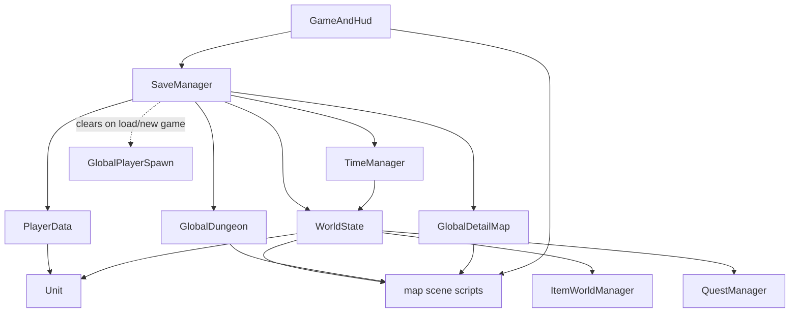
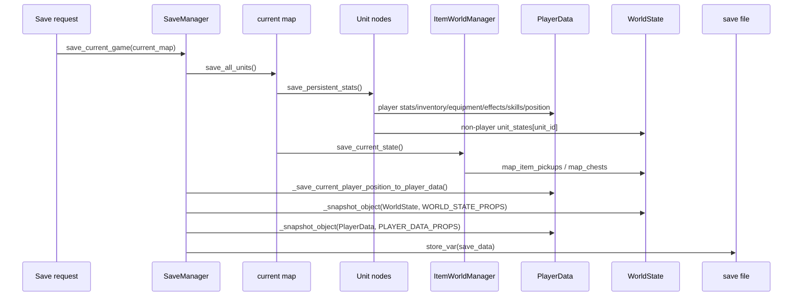
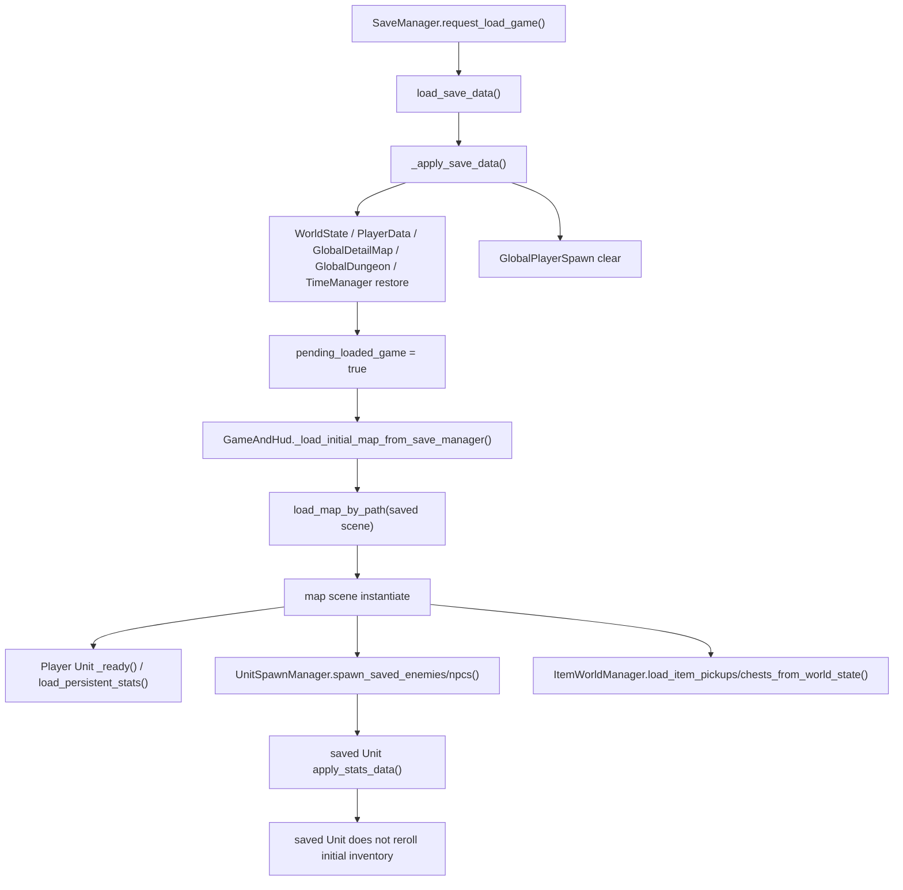

# Save / WorldState / PlayerData Map

このdocsは、`SaveManager` / `PlayerData` / `WorldState` を中心に、どの状態をどこが持ち、誰が保存し、誰が復元し、いつresetされるかを整理するための地図です。

## 目的

Save / Load / WorldState / PlayerData は、scene跨ぎ、map復元、new game reset、死亡状態、inventory復元、held item一時状態などに関わります。新しい永続状態を追加する時に、保存先、復元入口、reset対象を判断するためにこのdocsを使います。

今回のdocsは理解用であり、コード変更を前提にしません。実装を触る時は、このdocsで保存先を決めたうえで、保存、復元、reset、Godot確認をセットで見ます。

Map scene scriptsがどのWorldState keyを作成・復元・resetするかは [map_spawn_persistence_deep_dive.md](map_spawn_persistence_deep_dive.md) も参照してください。

Godot上でSave/Loadを確認する時は [../checklists/save_load_regression_matrix.md](../checklists/save_load_regression_matrix.md) を使います。

## 全体像

| 領域 | 主な保存先 | 主な保存者 | 主な復元者 | 役割 |
| --- | --- | --- | --- | --- |
| player固有状態 | `PlayerData` | `Unit.save_persistent_stats()`, `SaveManager._save_current_player_position_to_player_data()`, `InventoryUI` | `Unit.load_persistent_stats()`, `GameAndHud._restore_player_position_after_loaded_map_ready()`, `InventoryUI` | player stats、inventory、equipment、skills、effects、map position、held item一時状態。 |
| world/map状態 | `WorldState` | map scene scripts、`Unit.save_persistent_stats()`, `ItemWorldManager`, `QuestManager` | map scene scripts、`UnitSpawnManager`, `ItemWorldManager`, `QuestManager` | enemy/npc、map tile、pickup、chest、quest、dungeon/map生成状態。 |
| detail map文脈 | `GlobalDetailMap` + `WorldState.field_detail_map_data` | Field/detail map scripts、`SaveManager` | Field/detail map scripts、`GameAndHud` | 詳細マップの生成条件、戻り先、固有マップ文脈。 |
| dungeon文脈 | `GlobalDungeon` + `WorldState.dungeon_*` | dungeon/field scripts、`SaveManager` | `dungeon_main.gd`, FieldMap | 現在dungeon、階層、戻り先、floor data。 |
| 時間/turn | `TimeManager` | `TimeManager.advance_time()`, `SaveManager` | `SaveManager._apply_save_data()` | `world_time_seconds` とturn resolving状態。 |
| scene遷移直後のspawn位置 | `GlobalPlayerSpawn` | map scene scripts | 新map scene / player setup | 一時的な次tile。SaveManagerはload/new game時にclearし、save snapshotには含めません。 |

## 保存先の役割分担

| 保存先 | 持つべき状態 | 持たない方がいい状態 | 主な理由 |
| --- | --- | --- | --- |
| `PlayerData` | player固有のstats、inventory/hotbar、equipment、skills、effect runtime、map positions、debug start item適用済み、held item一時状態 | world/map全体、enemy/npc状態、chest node参照、merchant node参照、trade inventory参照 | playerだけに属する状態とscene跨ぎ一時状態の置き場。world状態を入れるとmap reset/save境界が曖昧になります。 |
| `WorldState` | mapごとのenemy/npc spawn list、Unit runtime state、map tile、pickup、chest、quest、dungeon/field生成状態、reset pending状態 | player専用UI状態、scene node参照、現在開いているInventoryUI/Chest/TradeのNode参照 | map/world単位の永続状態。key設計を間違えると復元や死亡状態が壊れます。 |
| `GlobalPlayerSpawn` | 次sceneでplayerを置く一時tile | save fileに残したい位置、長期保存したいmap状態 | scene遷移直後だけ使う一時情報。load時に残るとセーブ地点と別tileから開始する原因になります。 |
| `GlobalDungeon` | 現在dungeon ID、floor、戻り先、階段spawn type | floor tile dataやpickup/chest一覧 | dungeonの現在文脈。実体データは `WorldState.dungeon_*` やmap stateへ置きます。 |
| `GlobalDetailMap` | 現在詳細map key、generator type、field戻りtile、固有map文脈 | detail map上のUnit/Chest/Pickup node参照 | 詳細mapへ入る/戻る文脈を持つ一時Autoload。map実体はWorldState。 |
| `TimeManager` | `world_time_seconds`, `is_resolving_turn` | quest詳細、map reset対象一覧 | 時間の単一source。reset可否はWorldState側のpending/last indexも関係します。 |
| `QuestManager` | 処理ロジック、query/helper | 永続quest辞書本体 | quest状態本体は `WorldState.quest_*` に置かれます。 |
| `Unit node` | 現在scene上のruntime状態、Stats/Inventory/Equipment/Effects/Skills | sceneを跨いで直接保存したい参照 | scene unloadでfreeされます。保存時はDictionary化してPlayerData/WorldStateへ逃がします。 |
| `Inventory node` | bag/hotbarの現在entry | 永続先そのもの、他Unitやchestの参照 | `save_inventory_full_data()` でDictionary化して保存します。 |
| `Chest node` | 現在scene上のchest状態、inventory | save fileへ直接置くNode参照 | `get_save_data()` でDictionary化し、`WorldState.map_chests[map_id]` に保存します。 |
| `map scene node` | 現在mapのUnits/Pickups/Chests/TileMap node | 長期永続状態そのもの | map sceneは切り替えでfreeされるため、保存したい状態はWorldState/PlayerDataへ。 |

原則として、scene node参照は保存しません。`current_inventory`、`current_unit`、`trade_inventory`、`chest node`、`merchant unit reference` のような参照はscene跨ぎで無効になるため、必要な状態だけをDictionaryとして保存します。

## 保存対象一覧

| 状態 | 保存先 | 書き込む主な関数/場所 | 読み込む主な関数/場所 | reset対象か | 注意 |
| --- | --- | --- | --- | --- | --- |
| player stats | `PlayerData.max_hp` 等、`PlayerData.extended_stats_data` | `Unit.save_persistent_stats()` | `Unit.load_persistent_stats()` | new gameでreset | `extended_stats_data` があれば詳細statsを優先。 |
| player inventory / hotbar | `PlayerData.inventory_data` | `Unit.save_inventory_persistence_data()`, `Inventory.save_inventory_full_data()` | `Inventory.load_inventory_data()` | new gameでreset | 新形式はbag/hotbar/grid情報込み。旧Arrayも互換読み込み。 |
| player equipment | `PlayerData.equipment_data` | `Unit.get_equipment_save_data()` | `Unit.apply_equipment_save_data()` | new gameでreset | slot別entry。`instance_data` を維持する。 |
| player skills | `PlayerData.skills_data`, legacy `skill_state_data` | `Skills.get_skills_data()` through `Unit.save_persistent_stats()` | `Skills.apply_skills_data()`, legacy fallback | new gameでreset | active APIはSkills node。旧 `skill_state` は互換。 |
| player active effects / runtime modifiers | `PlayerData.effect_runtimes_data`, `last_effect_update_time` | `Unit.get_effect_runtimes_save_data()` | `Unit.load_effect_runtimes_save_data()`, `apply_offscreen_effect_elapsed()` | new gameでreset | offscreen tickでHPが減る場合は死亡判定へつなぐ。 |
| player map position | `PlayerData.current_map_id`, `current_tile`, `last_*`, `map_positions` | `Unit.save_persistent_stats()`, `SaveManager._save_current_player_position_to_player_data()` | `Unit.load_persistent_stats()`, `GameAndHud._restore_player_position_after_loaded_map_ready()` | new gameでreset | `GlobalPlayerSpawn` はsave fileには残しません。 |
| held item一時状態 | `PlayerData.held_inventory_*` | `InventoryUI.persist_held_state_to_player_data()` | `InventoryUI.restore_held_state_from_player_data()` | new gameでreset | scene跨ぎ用runtime一時状態。現状 `SaveManager.PLAYER_DATA_PROPS` には含まれません。 |
| debug start item applied state | `PlayerData.debug_start_items_applied` | Unit debug start item適用処理 | Unit起動時 | new gameでreset | new gameでは再配布できるようfalseへ戻す。 |
| enemy/npc stats | `WorldState.unit_states[unit_id]` | `Unit.get_stats_data()` through `save_persistent_stats()` | `Unit.apply_stats_data()` through `load_persistent_stats()` | new game/world/map resetで対象 | `get_stats_data()` はstats以外も含むruntime保存データ。 |
| enemy/npc inventory | `WorldState.unit_states[unit_id]["inventory"]` | `Inventory.save_inventory_full_data()` | `Inventory.load_inventory_data()` | unit state resetで対象 | saved Unitではinitial inventoryを再抽選しない。 |
| enemy/npc equipment | `WorldState.unit_states[unit_id]["equipment"]` | `Unit.get_equipment_save_data()` | `Unit.apply_equipment_save_data()` | unit state resetで対象 | 装備個体の `instance_data` を落とさない。 |
| enemy/npc death state | `WorldState.unit_states[unit_id]["is_dead"]`, spawn list `is_dead` | `Unit.handle_death()`, `_mark_spawn_data_dead()` | `UnitSpawnManager.spawn_saved_*()` | map/world/new game resetで対象 | dead Unitは再spawnしません。 |
| enemy spawn list | `WorldState.map_enemy_spawns[map_id]` | `UnitSpawnManager.spawn_enemy_random()` | `UnitSpawnManager.spawn_saved_enemies()` | map/world/new game resetで対象 | spawn listとunit_statesのunit_idを合わせる。 |
| npc spawn list | `WorldState.map_npc_spawns[map_id]` | `UnitSpawnManager.spawn_npc_random()` | `UnitSpawnManager.spawn_saved_npcs()` | map/world/new game resetで対象 | quest NPC保護の例外あり。 |
| chest inventory/state | `WorldState.map_chests[map_id]` | `ItemWorldManager.save_chests_to_world_state()`, `Chest.get_save_data()` | `ItemWorldManager.load_chests_from_world_state()`, `Chest.load_from_save_data()` | map/world/new game resetで対象 | 現状chestは `inventory.save_inventory_data()` でbagを保存。 |
| pickup state | `WorldState.map_item_pickups[map_id]` | `ItemWorldManager.save_item_pickups_to_world_state()`, `ItemDropHelper` | `ItemWorldManager.load_item_pickups_from_world_state()` | map/world/new game resetで対象 | `instance_data` 付きpickupも保存対象。 |
| map tile state | `WorldState.map_tile_data[map_id]` | map scene `save_map_tiles()` | map scene `load_map_tiles()` | map/world/new game resetで対象 | tilemap layerをDictionary配列化。 |
| quest state | `WorldState.quest_active_data`, `quest_completed_data`, `quest_failed_data` | `QuestManager` | `QuestManager` | new gameでreset、NPC/world resetで一部対象 | generated questの扱いに注意。 |
| generated quest state | `WorldState.unit_generated_quests`, `npc_quest_generation_blocked_until_reset` | `QuestManager`, `WorldState` | `QuestManager` | new game/NPC resetで対象 | active generated questがあるNPCは保護されることがあります。 |
| dungeon floor state | `WorldState.dungeon_floor_data`, `dungeon_map_data`, `dungeon_data` | `dungeon_main.gd`, FieldMap dungeon entrance処理 | `dungeon_main.gd` | new game/world resetで対象 | dungeon遷移中に雑に消すと階層生成が壊れます。 |
| detail map return context | `GlobalDetailMap`, `WorldState.field_detail_map_data`, `unique_map_instances` | FieldMap/detail map scripts | FieldMap/detail map scripts | new game/world/map resetで対象 | scene nodeではなくID/tile/scene pathを持つ。 |
| time / turn state | `TimeManager.world_time_seconds`, `is_resolving_turn` | `TimeManager.advance_time()`, `SaveManager` | `SaveManager._apply_save_data()` | new gameでreset | Save fileには `world_time_seconds` のみ保存し、load時に `is_resolving_turn=false`。 |

## Save Flow

Save時の要点:

- `SaveManager.save_current_game()` は、まずcurrent mapの `save_all_units()` を呼びます。
- map `save_all_units()` はUnits配下のUnitに `save_persistent_stats()` を呼びます。
- detail/dungeon/start系の一部mapでは、同じ関数内で `ItemWorldManager.save_current_state()` も呼びます。
- `Unit.save_persistent_stats()` はplayerなら `PlayerData`、non-playerなら `WorldState.unit_states[unit_id]` へ書きます。
- `Inventory.save_inventory_full_data()` はbag/hotbar/grid情報をまとめて保存します。
- `SaveManager` は `WorldState`、`PlayerData`、`TimeManager.world_time_seconds`、`GlobalDetailMap`、`GlobalDungeon` をsnapshotします。
- `GlobalPlayerSpawn` はsnapshotしません。

## Load Flow

Load時の要点:

- `SaveManager.request_load_game()` はsave fileを読み、Autoload snapshotを先に復元します。
- `pending_loaded_map_scene_path` をセットし、`GameAndHud` が次に読むmapを決めます。
- `GameAndHud._load_initial_map_from_save_manager()` はpending mapをconsumeしてmap sceneをロードします。
- load後のplayer位置は `GameAndHud._restore_player_position_after_loaded_map_ready()` が `PlayerData` を見て補正します。
- enemy/npcは `WorldState.map_enemy_spawns` / `map_npc_spawns` からspawn listを読み、deadなら生成しません。
- saved Unitに `WorldState.unit_states[unit_id]` がある場合、`Unit.apply_stats_data()` でstats/inventory/equipment/effects/skills/tileを復元します。
- saved Unitでは `initial_inventory_*` を再抽選しません。`_has_saved_inventory_state()` が保存済みinventoryを検知し、初期所持品追加を避けます。
- pickup/chest/map tileはWorldStateから復元します。

## New Game / Reset Flow

`SaveManager.start_new_game()` は `reset_runtime_state_for_new_game()` を呼んでから、初期mapをpending load扱いにします。

| 状態 | new gameでreset | world resetでreset | map resetでreset | 注意 |
| --- | --- | --- | --- | --- |
| `PlayerData` stats/inventory/equipment/effects/skills | はい | いいえ | いいえ | new gameでplayer状態を初期値へ。 |
| `PlayerData.map_positions` | はい | いいえ | いいえ | save/loadのplayer復元用。 |
| `PlayerData.held_inventory_*` | はい | いいえ | いいえ | `clear_held_inventory_state()`。save snapshot対象ではありません。 |
| `debug_start_items_applied` | はい | いいえ | いいえ | new gameでfalseへ戻す。 |
| `WorldState.unit_states` | はい | 一部 | mapに応じて一部 | monthly resetでは対象mapのUnit stateだけ消すことがあります。 |
| `map_enemy_spawns` / `map_npc_spawns` | はい | 一部 | 対象mapのみ | active quest NPCがいるmapは保護される場合があります。 |
| `map_tile_data` | はい | 一部 | 対象mapのみ | FieldMap本体はreset対象外。 |
| `map_item_pickups` / `map_chests` | はい | 一部 | 対象mapのみ | map resetで消えると再生成対象になります。 |
| quest active/completed/failed | はい | generated questのみ一部 | いいえ | NPC reset設定によりgenerated questを消す/残す分岐あり。 |
| `unit_generated_quests` | はい | NPC resetで対象 | いいえ | active generated quest NPCは保護されることがあります。 |
| `dungeon_*` | はい | FieldMap上のworld resetで対象 | dungeon reset時 | dungeon内移動中に消さない。 |
| `GlobalDetailMap` | はい | 場合による | map transitionで更新 | `SaveManager._reset_global_detail_map()`。 |
| `GlobalDungeon` | はい | FieldMap上のworld resetで対象 | dungeon clear時 | `SaveManager._reset_global_dungeon()`。 |
| `GlobalPlayerSpawn` | はい | 遷移ごとに消費 | 遷移ごとに消費 | load/new game時にclear。 |
| `TimeManager.world_time_seconds` | はい | いいえ | いいえ | `reset_time()` で0。 |

## PlayerData Deep Dive

| カテゴリ | 代表フィールド | 誰が書く | 誰が読む | 注意 |
| --- | --- | --- | --- | --- |
| stats | `max_hp`, `hp`, `attack`, `defense`, `speed`, `extended_stats_data` | `Unit.save_persistent_stats()` | `Unit.load_persistent_stats()` | `extended_stats_data` は詳細stats保存。 |
| inventory | `inventory_data` | `Unit.save_inventory_persistence_data()`, Inventory操作後同期 | `Inventory.load_inventory_data()` | Variant。旧Arrayと新Dictionaryに対応。 |
| equipment | `equipment_data` | `Unit.get_equipment_save_data()` | `Unit.apply_equipment_save_data()` | slot別entry。 |
| skills | `skills_data`, `skill_state_data` | `Skills.get_skills_data()` | `Skills.apply_skills_data()`, legacy fallback | 旧 `skill_state_data` は互換。 |
| effect runtimes | `effect_runtimes_data`, `last_effect_update_time` | `Unit.get_effect_runtimes_save_data()` | `Unit.load_effect_runtimes_save_data()` | offscreen elapsed用の時間も保持。 |
| map positions | `current_map_id`, `current_tile`, `last_map_id`, `last_tile`, `map_positions` | `Unit.save_persistent_stats()`, `SaveManager._save_current_player_position_to_player_data()` | `Unit.load_persistent_stats()`, `GameAndHud` | map_idごとのplayer tile。 |
| held inventory state | `held_inventory_entry`, `held_inventory_source_*`, `held_inventory_previous_ui_mode` | `InventoryUI` | `InventoryUI` | scene跨ぎruntime一時状態。scene node参照は保存しません。 |
| debug flags | `debug_start_items_applied` | Unit debug start item処理 | Unit起動時 | new gameでfalseへ戻す。 |

PlayerDataに入れるべきものは、player固有の永続状態か、scene跨ぎで必要なplayer限定一時状態です。player固有以外のworld状態を入れすぎないこと、scene node参照を保存しないことが重要です。held itemはentryとsource情報だけを保存し、`trade_inventory` / `chest node` / `merchant unit` 参照は保存しません。

## WorldState Deep Dive

| カテゴリ | 代表フィールド/辞書 | 誰が書く | 誰が読む | 注意 |
| --- | --- | --- | --- | --- |
| map enemy spawns | `map_enemy_spawns[map_id]` | `UnitSpawnManager.spawn_enemy_random()`, death mark | `UnitSpawnManager.spawn_saved_enemies()` | spawn dataに `unit_id`, type, tile, `is_dead` を持つ。 |
| map npc spawns | `map_npc_spawns[map_id]` | `UnitSpawnManager.spawn_npc_random()`, death mark | `UnitSpawnManager.spawn_saved_npcs()` | quest NPC保護に注意。 |
| unit states | `unit_states[unit_id]` | `Unit.save_persistent_stats()`, `Unit.handle_death()` | `Unit.load_persistent_stats()` | stats/inventory/equipment/effects/skills/tileを含む。 |
| chest states | `map_chests[map_id]` | `ItemWorldManager.save_chests_to_world_state()` | `ItemWorldManager.load_chests_from_world_state()` | chest_id/type/tile/opened/inventory。 |
| pickup states | `map_item_pickups[map_id]` | `ItemWorldManager`, `ItemDropHelper` | `ItemWorldManager.load_item_pickups_from_world_state()` | pickup entryとtile。 |
| map tile states | `map_tile_data[map_id]` | map scene `save_map_tiles()` | map scene `load_map_tiles()` | ground/wall/event layer data。 |
| quest/world flags | `quest_active_data`, `quest_completed_data`, `quest_failed_data` | `QuestManager` | `QuestManager`, UI | generated questの消し方に注意。 |
| generated quest cache | `unit_generated_quests`, `npc_quest_generation_blocked_until_reset` | `QuestManager`, `WorldState` | `QuestManager` | NPC resetで更新。 |
| dungeon states | `dungeon_data`, `dungeon_floor_data`, `dungeon_map_data`, `field_dungeon_entrances` | FieldMap, `dungeon_main.gd` | FieldMap, `dungeon_main.gd` | dungeon内で雑にclearしない。 |
| detail/unique map states | `field_detail_map_data`, `field_special_places`, `unique_map_instances` | FieldMap/detail scripts | FieldMap/detail scripts | unique mapはinstance_id/key設計に注意。 |
| reset state | `last_monthly_reset_month_index`, `monthly_reset_pending`, `deferred_reset_*`, `last_npc_reset_index`, `npc_reset_pending` | `TimeManager`, `WorldState` | `GameAndHud`, FieldMap | resetタイミングの状態。 |

WorldStateは `map_id`、`unit_id`、`chest_id`、`instance_id` などのkey設計が重要です。雑にclearすると、復元、死亡状態、quest NPC保護、dungeon階層状態が壊れます。saved Unitではinitial inventoryを再抽選しません。

## Unit保存との関係

| Unit種別 | 保存先 | 保存入口 | 復元入口 | 注意 |
| --- | --- | --- | --- | --- |
| Player | `PlayerData` | `Unit.save_persistent_stats()`, `SaveManager._save_current_player_position_to_player_data()` | `Unit.load_persistent_stats()`, `GameAndHud._restore_player_position_after_loaded_map_ready()` | playerはWorldState.unit_statesへは保存しない。 |
| Enemy | `WorldState.unit_states`, `map_enemy_spawns` | `Unit.save_persistent_stats()`, death mark | `UnitSpawnManager.spawn_saved_enemies()`, `Unit.load_persistent_stats()` | deadならspawnしない。saved inventoryがあればinitial inventoryを再抽選しない。 |
| NPC | `WorldState.unit_states`, `map_npc_spawns` | `Unit.save_persistent_stats()`, death mark | `UnitSpawnManager.spawn_saved_npcs()`, `Unit.load_persistent_stats()` | shop inventory resetはNPC reset処理と絡む。 |
| dead Unit | `WorldState.unit_states[unit_id]["is_dead"]`, spawn list `is_dead` | `Unit.handle_death()` | `UnitSpawnManager.spawn_saved_*()` | 二重死亡/dropを避けるため `death_handled` guardがある。 |
| saved Unit | `WorldState.unit_states[unit_id]` | map `save_all_units()` | `Unit.apply_stats_data()` | inventory/equipment/effects/skills/tileを復元。 |
| new spawned Unit | spawn list + data TSV | `UnitSpawnManager.spawn_*_random()` | `apply_enemy_data()` / `apply_npc_data()` | 新規生成時だけinitial inventoryを適用。 |

`Unit.get_stats_data()` は名前より広く、以下を含みます。

- `Stats.get_stats_data()` の基礎/現在stats
- tile位置
- inventory/hotbar
- equipment
- faction
- combat/move style override
- active effect runtimes
- skills
- last effect update time

`Unit.apply_stats_data()` はこの逆方向を復元します。player用の `save_persistent_stats()` / `load_persistent_stats()` は `PlayerData` を使い、non-player用は `WorldState.unit_states` を使います。

## Scene Transitionとの関係

| 対象 | scene跨ぎで保持するか | 保存先 | 注意 |
| --- | --- | --- | --- |
| player position | はい | `PlayerData.map_positions`, `GlobalPlayerSpawn` | long-termはPlayerData、一時遷移tileはGlobalPlayerSpawn。 |
| player inventory | はい | `PlayerData.inventory_data` | save/loadとscene遷移で復元。 |
| held item | はい、runtime一時状態として | `PlayerData.held_inventory_*` | entry/source情報のみ。Save file snapshot対象ではない。 |
| current_inventory reference | いいえ | なし | scene node参照はfreeされる。 |
| current_unit reference | いいえ | なし | Unit node参照は保存しない。 |
| trade_inventory reference | いいえ | なし | 特殊UI modeはscene跨ぎでnormalへ正規化。 |
| chest node reference | いいえ | なし | chest stateはWorldStateへDictionary保存。 |
| merchant unit reference | いいえ | なし | merchantはunit_idやWorldStateで扱う。 |
| enemy/npc node | node参照はいいえ、状態ははい | `WorldState.unit_states`, spawn list | scene再生成時にDictionaryから復元。 |
| pickup node | node参照はいいえ、状態ははい | `WorldState.map_item_pickups` | `ItemWorldManager` が再spawn。 |
| chest node | node参照はいいえ、状態ははい | `WorldState.map_chests` | `Chest.load_from_save_data()`。 |
| map tile state | はい | `WorldState.map_tile_data` | TileMapLayerをDictionary配列に変換。 |

scene node参照は基本的に持ち越しません。必要な状態だけ `PlayerData` / `WorldState` / `Global*` に逃がします。

## 保存先を追加するときの判断基準

| 追加したい状態 | 保存先候補 | 判断基準 | reset確認 | 注意 |
| --- | --- | --- | --- | --- |
| player専用の恒久ステータス | `PlayerData.extended_stats_data` または個別field | playerだけに属するか | `PlayerData.reset_for_new_game()` | Unit load/save両方に追加する。 |
| playerの一時UI状態 | `PlayerData` の一時field | scene跨ぎで必要か、save fileに必要か | clear関数/new game | scene node参照を入れない。SaveManager snapshot対象にするか明確にする。 |
| mapごとの敵死亡状態 | `WorldState.unit_states`, spawn list | unit_id/map_idで特定できるか | map/world/new game reset | spawn listとunit_statesを同期する。 |
| mapごとの宝箱状態 | `WorldState.map_chests[map_id]` | chestがmapに属するか | map/world/new game reset | chest nodeではなくsave dataを保存。 |
| mapごとの落ちているitem | `WorldState.map_item_pickups[map_id]` | pickupがmapに属するか | map/world/new game reset | `instance_data` を落とさない。 |
| ダンジョン階層状態 | `WorldState.dungeon_floor_data` / `GlobalDungeon` | 永続floor dataか現在文脈か | dungeon/world/new game reset | dungeon内移動中にglobal dataを消さない。 |
| クエスト進行状態 | `WorldState.quest_*` | active/completed/failedのどれか | new game/NPC reset | generated questと固定questを分ける。 |
| NPC個別状態 | `WorldState.unit_states[unit_id]` | NPC unit_idで追跡するか | NPC reset/map reset/new game | trade inventoryだけ消す処理と混ざらないようにする。 |
| Debug確認済みフラグ | `PlayerData` または `DebugSettings` | runtime永続か単なる設定か | new game/reset | default OFFとreset漏れに注意。 |

## 禁止事項・注意

- scene node参照を保存しない。
- PlayerDataにworld状態を入れすぎない。
- WorldStateを雑に全clearしない。
- saved Unitでinitial inventoryを再抽選しない。
- shop inventoryと本体inventoryを混ぜない。
- held itemを `item_id` だけで保存しない。entry全体とsource情報を保持する。
- `instance_data` を落とさない。
- new game/reset時に新規追加状態のresetを忘れない。
- save対象追加時は、保存、復元、reset、Godot確認をセットで見る。
- `GlobalPlayerSpawn` はsave fileに残さない。load時はclearする。
- TimeManagerの時間だけでなく、WorldState側のreset index/pendingも一緒に見る。

## Save/Load変更時の確認リスト

- new game開始
- save
- load
- map移動後save/load
- dungeon内save/load
- player inventory復元
- player equipment復元
- `instance_data` 付き装備の復元
- held itemを持ったままscene移動
- enemy死亡状態の復元
- enemy/npc inventoryの復元
- chest中身の復元
- pickupの復元
- quest進行の復元
- active/generated questの復元
- initial inventoryが二重適用されない
- player active effects / status runtimeが復元される
- offscreen elapsedでstatus tickが進んだ場合も死亡判定が走る
- world reset / map resetで期待通り消える
- `GlobalPlayerSpawn` がload後に残らない

## 今回は直さないが気になる点

- `SaveManager.PLAYER_DATA_PROPS` には `PlayerData.held_inventory_*` が含まれていません。これはscene跨ぎruntime一時状態としては自然ですが、「held item中に手動saveしたい」仕様を将来入れる場合は、保存するか、saveを拒否するかを別途決める必要があります。
- `SaveManager.debug_print_non_player_units_on_save` は現状trueです。調査には便利ですが、ログ整理をする場合は挙動変更と混ぜず別Stepが安全です。
- `Unit.get_stats_data()` はstats以外も多く含むため、新しい保存項目を足す時に見落としやすい名前です。将来、docs上の呼称かhelper名の整理候補になります。

## Quest / Generated Quest保存メモ

Quest lifecycleの詳細は [quest_generated_lifecycle_deep_dive.md](quest_generated_lifecycle_deep_dive.md) を参照します。

| WorldState field | SaveManager保存対象 | 役割 |
| --- | --- | --- |
| `quest_active_data` | yes | 受注中quest。NPC会話、掲示板、StatusUIが読む。 |
| `quest_completed_data` | yes | 完了済みquest履歴。 |
| `quest_failed_data` | yes | 失敗/破棄quest履歴。generated questの再生成ブロック判定にも関係。 |
| `unit_generated_quests` | yes | Unitごとのgenerated quest cache。 |
| `npc_quest_generation_blocked_until_reset` | no | 失敗/破棄後、NPC resetまでgenerated quest再生成を止めるruntime reset state。 |

Quest関連の保存仕様を変える場合は、受注中generated questがsave/load後も同じgiverに報告できるかを必ず確認します。
