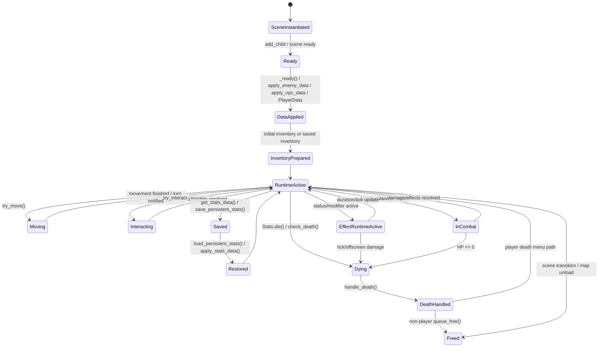

# Unit Lifecycle Deep Dive

`scripts/core/unit.gd` は Player / Enemy / NPC の共通本体です。移動、interaction、Stats、Inventory、Equipment、Skills、ItemEffect、死亡処理、death drop、save/load まで集まっているため、最初から上から読むと迷いやすいファイルです。

このメモの目的は、`unit.gd` を変更するときに「どのライフサイクル領域を読めばよいか」を判断しやすくすることです。実装を分割する指示ではなく、現状理解のための地図です。

Unit生成がmap scene scripts、`UnitSpawnManager`、WorldState保存とどうつながるかは [map_spawn_persistence_deep_dive.md](map_spawn_persistence_deep_dive.md) も参照してください。

Godot上でUnit save/load、enemy死亡、initial inventory再抽選防止を確認する時は [../checklists/save_load_regression_matrix.md](../checklists/save_load_regression_matrix.md) を使います。

## Unitの領域別責務

| 領域 | Unitが担当すること | 主に関係するファイル | 変更時の注意 |
| --- | --- | --- | --- |
| identity / type / faction | `unit_id`、`map_id`、player判定、faction、role、talk可能性などを持つ | `scripts/core/unit.gd`, `scripts/data/enemy_data.gd`, `scripts/data/npc_data.gd` | `unit_id` は `WorldState.unit_states` や spawn list のキーになるため、生成後に軽く変えない。 |
| Stats | `Stats` child nodeへ基礎値を適用し、合計stat getterを提供する | `scripts/core/unit.gd`, `scripts/core/stats.gd`, `scripts/combat/damage_calculator.gd` | HPを直接変更する経路は死亡判定漏れに注意。原則 `Stats.take_damage()` か `Unit.check_death()` へつなぐ。 |
| Inventory | `Inventory` child nodeを本体所持品として扱う | `scripts/core/unit.gd`, `scripts/item/inventory.gd`, `scripts/item/inventory_ui.gd` | 本体inventoryはdeath drop対象。shop inventoryと混ぜない。 |
| Equipment | `equipped_items` にslot別entryを保持し、装備save/loadとstat合計に使う | `scripts/core/unit.gd`, `scripts/data/equipment_data.gd`, `scripts/item/inventory_ui.gd`, `scripts/item/item_database.gd` | 装備entryの `instance_data` を維持する。bagとequipmentの二重所持に注意。 |
| Skills | `Skills` child nodeへ初期値、TSV由来skill、save/loadを委譲する | `scripts/core/unit.gd`, `scripts/core/skills.gd`, `scripts/hud/status_ui.gd` | 正式APIは `Skills` node。旧 `skill_state` は互換読み込みだけ。 |
| Movement | tile移動、collision、bump attack、scene transitionを処理する | `scripts/core/unit.gd`, `scripts/controllers/player_controller.gd`, `scripts/controllers/ai_controller.gd`, map scene scripts | `try_move()` は移動だけでなく攻撃、pickup、turn通知、scene遷移にも触る。 |
| Interaction | pickup、talk、chest、quest board、stairs/map transitionなどの入口を持つ | `scripts/core/unit.gd`, `scripts/item/chest/chest.gd`, `scripts/managers/dialogue_manager.gd`, `scripts/managers/quest_board_manager.gd` | UI lock中やinventory中の挙動差に注意。 |
| Combat connection | 攻撃可否やダメージ実行は `CombatManager` に委譲し、Unitはstat/equipment/effect情報を提供する | `scripts/core/unit.gd`, `scripts/combat/combat_manager.gd`, `scripts/combat/damage_calculator.gd` | Unitだけで戦闘を完結させない。装備攻撃効果はCombatManager側でdispatchする。 |
| ItemEffect connection | runtime status/modifierをUnit上に保持し、tickやoffscreen elapsedを処理する | `scripts/core/unit.gd`, `scripts/item/item_effect_manager.gd`, `scripts/item/unit_effect_runtime.gd` | tick damageも死亡処理へ到達する必要がある。runtime modifierはstat getterに影響する。 |
| Initial inventory | Enemy/NPC生成時、保存済みinventoryがない場合だけspawn-time所持品を追加する | `scripts/core/unit.gd`, `scripts/data/initial_inventory_entry.gd`, `scripts/data/game_data_registry.gd`, `scripts/managers/unit_spawn_manager.gd` | death時のloot再抽選ではない。saved Unitでは再抽選しない。 |
| Death handling | HP0以下を検出し、`death_handled` で二重処理を防ぐ | `scripts/core/unit.gd`, `scripts/core/stats.gd`, `scripts/combat/combat_manager.gd` | HP0への全経路が `handle_death()` に到達するか確認する。 |
| Death drop | 実際に持っているbag / hotbar / equipmentを設定に応じて地面へ落とす | `scripts/core/unit.gd`, `scripts/item/item_drop_helper.gd`, `docs/systems/death_drop_spec.md` | `initial_inventory_entries.tsv` は死亡時に読み直さない。drop-only tableはまだ作らない。 |
| Save / Load | PlayerData / WorldStateへstats、position、inventory、equipment、effects、skillsを保存復元する | `scripts/core/unit.gd`, `scripts/data/player_data.gd`, `scripts/world/world_state.gd`, `scripts/save_manager.gd` | PlayerとEnemy/NPCで保存先が違う。scene node参照は保存しない。 |

## Unit Lifecycle Overview



この図のポイントは、Unitは一度だけ生成されるとは限らないことです。map再訪、save/load、scene遷移で古いnodeはfreeされ、新しいnodeへ保存済み状態が復元されます。跨いで保持したい状態は `PlayerData` や `WorldState` に置き、scene内node参照を持ち越さない方針です。

## 生成と初期化

Unit scene の生成元はUnit種別で少し違います。

- Playerは多くのmap sceneの `Units` 配下に `scenes/unit.tscn` 系のUnitとして置かれています。`is_player_unit=true` と `unit_id="player"` が基本です。
- Enemyは `UnitSpawnManager.spawn_enemy_random()` / `spawn_saved_enemies()` がsceneをinstantiateし、`enemy_data_to_apply` を設定してから `add_child()` します。`unit.gd` の `_ready()` 内で `apply_enemy_data()` が呼ばれます。
- NPCは `UnitSpawnManager.spawn_npc_random()` / `spawn_saved_npcs()` で生成され、現在は `add_child()` 後に `apply_npc_data()` を直接呼ぶ経路があります。special mapでは `npc_data_to_apply` を渡す経路もあります。
- `unit.gd` の `_ready()` は、map layer参照、controller setup、animation、Enemy/NPC data適用、永続状態load、debug start item、player spawn位置などをまとめて処理します。
- Unitはchild nodeとして `Stats`、`Inventory`、`Skills` を参照します。`UnitSpawnManager.ensure_inventory_node()` はランダム生成UnitにInventory nodeがない場合の補助も行います。
- Controllerは `controller.setup(self)` でUnitを受け取り、Player/AI/NPC/Enemyごとの入力や行動選択から `Unit.try_move()` などを呼びます。

主な入口:

| 種別 | 生成入口 | data適用入口 | 初期化で見る場所 | 注意 |
| --- | --- | --- | --- | --- |
| Player | map scene内の配置済みUnit | `load_persistent_stats()` / `PlayerData` | `Unit._ready()`, `GameAndHud.find_player()` | mapごとの復元位置は `PlayerData.map_positions` と `GlobalPlayerSpawn` が絡む。 |
| Enemy | `UnitSpawnManager.spawn_enemy_random()` / `spawn_saved_enemies()` | `enemy_data_to_apply` -> `_ready()` -> `apply_enemy_data()` | `unit.gd`, `unit_spawn_manager.gd` | 新規ランダム生成では古い `WorldState.unit_states` を消してから生成する。 |
| NPC | `UnitSpawnManager.spawn_npc_random()` / `spawn_saved_npcs()` / special map | `apply_npc_data()` または `npc_data_to_apply` | `unit.gd`, `unit_spawn_manager.gd`, special map script | Enemyとdata適用タイミングが少し違うため、save/load絡みの変更時は経路を確認する。 |

## Data適用

Enemy/NPCはTSV由来の `EnemyData` / `NpcData` をUnitへ写します。Playerは主にscene上の初期値と `PlayerData` 復元で構成されます。

| Unit種別 | データ元 | 適用関数 | 主に設定されるもの | 注意 |
| --- | --- | --- | --- | --- |
| Player | scene初期値、`PlayerData`、debug settings | `_ready()`, `load_persistent_stats()`, `apply_stats_data()` | stats、inventory、equipment、skills、effect runtimes、map position | scene遷移でnodeは作り直される。永続状態は `PlayerData`。 |
| Enemy | `EnemyData` from `enemies.tsv` | `apply_enemy_data()` | stats、faction、element、skills、equipment、AI style、talk/shop/quest fields、death drop flags、initial inventory | saved inventoryがある場合はinitial inventoryを再抽選しない。 |
| NPC | `NpcData` from `npcs.tsv` | `apply_npc_data()` | stats、faction、skills、equipment、talk/shop/quest fields、friendliness、death drop flags、initial inventory | shop inventoryは取引用在庫で、本体inventoryとは別概念。 |
| saved Enemy/NPC | `WorldState.unit_states[unit_id]` | `load_persistent_stats()` -> `apply_stats_data()` | stats、tile、inventory、equipment、AI style、skills、effect runtimes | `check_death("load")` によりHP0保存状態も死亡処理へ進む。 |

`apply_enemy_data()` / `apply_npc_data()` はとても広い関数です。変更するときは「statsだけ」「equipmentだけ」「death drop flagsだけ」のように目的を絞って読むのが安全です。

## Inventory / Equipment / Initial Inventory

Unitの本体所持品は `Unit.inventory` です。これは `Inventory` child nodeで、bagとhotbarを持ちます。装備中itemは `Unit.equipped_items` にslot別entryとして保持されます。

### initial inventory

- `initial_inventory_table_id` は `GameDataRegistry` で `InitialInventoryEntry` 配列に解決され、`EnemyData.initial_inventory_items` / `NpcData.initial_inventory_items` に入ります。
- Unit生成時、`_has_saved_inventory_state()` がfalseなら `apply_initial_inventory_from_data()` が呼ばれます。
- 各entryは独立判定です。`guaranteed=true` は必ず生成、falseなら `spawn_chance` で判定します。
- 数量は `min_amount` / `max_amount` の範囲で決まります。
- 保存済みUnitでは、保存済みinventoryを優先し、initial inventoryを再抽選しません。

### shop inventoryとの違い

| 種類 | 所有者 | 生成元 | death drop対象 | 注意 |
| --- | --- | --- | --- | --- |
| bag | Unit本体 | initial inventory、pickup、UI操作 | 対象 | 実際にUnitが持っているitem。 |
| hotbar | Unit本体 | inventory save data、UI操作 | 対象 | death dropではinventory扱い。 |
| equipment | Unit本体 | enemy/npc equipment、UI操作 | flag次第 | `drop_equipped_items_on_death` を見る。 |
| shop inventory | merchant/trade用在庫 | shop table / shop loot / fallback columns | 対象外 | 本体inventoryやdeath dropと混ぜない。 |

詳しくは [inventory_trade_chest_system_deep_dive.md](inventory_trade_chest_system_deep_dive.md)、[data_spawn_save_system_deep_dive.md](data_spawn_save_system_deep_dive.md)、[unit_combat_death_system_deep_dive.md](unit_combat_death_system_deep_dive.md) も参照してください。

## Stats / Equipment Stat / Effect Runtime

`Stats` nodeは基礎値とHP/MP等の現在値を持ちます。Unit側の `get_total_attack()`、`get_total_defense()`、`get_total_speed()` などは、基礎値に装備、enchant、装備パッシブ効果、runtime modifierを重ねた値を返します。

主なstat補正源:

| 補正源 | 主な入口 | 反映先 | 注意 |
| --- | --- | --- | --- |
| EquipmentDataの固定bonus | `get_equipped_resource()`、各 `get_total_*()` | attack / defense / speed等 | 装備を外せば消える一時的な合計値。 |
| 装備entryのenchant / instance data | `get_equipped_enchantments()` | statや価格等 | `instance_data` を消すと装備個体情報が失われる。 |
| 装備パッシブ `apply_modifier` | `get_equipped_item_effects()`、`_get_total_equipment_effect_modifier()` 系 | stat getter | `item_effect_links.tsv` 由来。`equipment_effect_links.tsv` は作らない方針。 |
| runtime modifier | `active_effect_runtimes`、`recompute_runtime_modifiers()` | `get_modified_stat_value()` | status/buff/debuffの持続効果。 |
| tick damage | `advance_effect_runtimes()`、`process_effect_ticks()` | HP | HPを減らした後は死亡判定へつなぐ。 |

重要な注意:

- HPを減らす新規経路は、できるだけ `Stats.take_damage()` を使ってください。
- どうしても直接 `stats.hp` を変更する場合は、直後に `Unit.check_death(cause)` を呼ぶ必要があります。
- 直接HPだけ減らして死亡判定を呼ばないと、HP0なのに `handle_death()`、death drop、WorldState死亡保存が走らない危険があります。

## Movement / Interaction

`Unit.try_move(dir)` は単なる移動関数ではありません。以下をまとめて扱います。

- UI lock確認
- 向き更新
- 次tile計算
- scene transfer tileのブロック判定
- target Unitがいる場合のbump attack
- collision判定
- 実移動または補間移動
- pickup
- `TimeManager.notify_unit_move_finished()`
- stairs / scene transition
- map保存と `request_map_change()`

| 操作 | 主な入口 | Unit側の関数 | 呼び出し先 | 注意 |
| --- | --- | --- | --- | --- |
| player移動 | `PlayerController.try_move_in_direction()` | `try_move()` | `CombatManager.try_bump_attack()`, `TimeManager`, map transition | 通常inventory中は移動可、trade/chest等の特殊UI中は移動不可。 |
| enemy/NPC移動 | `AIController` / `EnemyController` / `NpcController` | `try_move()` | `Targeting`, `CombatManager`, `TimeManager` | AIの行動選択とUnitの移動実行を混ぜない。 |
| pickup | 移動後auto pickup、interact | `try_pickup_items_on_current_tile()` | `ItemPickup`, `Inventory`, `WorldState` | pickupの永続化とstackに注意。 |
| chest | player interact | `try_open_chest_on_current_tile()` | `Chest.open_chest()`, `InventoryUI.open_chest_mode()` | chest UIは特殊Inventory mode。scene跨ぎ参照を持ち越さない。 |
| talk / trade | player interact | `try_talk_to_front_unit()` | `DialogueManager`, `GameAndHud.open_trade_ui()` | trade中は移動不可。merchant本体inventoryとshop在庫を混ぜない。 |
| quest board | player interact | `try_open_quest_board()` | `QuestBoardManager` | UI lock経路に注意。 |
| map transition | touch / interact | `try_move()`, `try_interact_transition()` | `GlobalPlayerSpawn`, `GlobalDungeon`, `GlobalDetailMap`, `GameAndHud` | 遷移前にmap_rootの `save_all_units()` が絡む。 |

## Combat Connection

Unitは戦闘を単独で完結させません。攻撃の成立、命中、ダメージ、装備攻撃効果のdispatchは `CombatManager` と `DamageCalculator` が中心です。

UnitがCombat側へ提供する主な情報:

- faction / hostile判定に必要な情報
- 現在tileと攻撃範囲
- `get_total_attack()` / `get_total_defense()` / `get_total_accuracy()` 等の合計stat
- default attack element / damage type
- 装備中武器の攻撃範囲や攻撃属性
- `get_equipped_attack_effects()` による装備攻撃効果候補
- `is_action_blocked_by_status()` による行動不能判定

典型的な流れ:

1. Controllerやtargeting操作が攻撃対象を決めます。
2. `CombatManager.can_attack()` が距離、敵対、HP、行動不能を確認します。
3. `DamageCalculator.calculate_damage()` が命中と通常ダメージを計算します。
4. 命中したら `target.stats.take_damage(damage)` でHPを減らします。
5. `CombatManager._apply_equipment_attack_effects()` が `attacker.get_equipped_attack_effects()` を使い、`deal_damage` / `apply_status` / `restore_resource` を処理します。
6. HP0なら `Stats.die()` または `Unit.check_death()` から死亡処理へ進みます。

装備攻撃効果はUnitではなくCombatManager側で実行されます。Unit側は「どの装備のどのeffectか」を取り出す共通APIを提供する役目です。

## Death Handling / Death Drop

死亡経路の中心は以下です。

```text
Stats.take_damage()
-> Stats.die()
-> Unit.handle_death()
```

または:

```text
HP直接変更
-> Unit.check_death(cause)
-> Unit.handle_death()
```

`Unit.handle_death()` は最初に `death_handled` を確認します。これにより、通常攻撃、追加ダメージ、status tick、load時HP0など複数の経路から呼ばれても、死亡処理とdeath dropが二重に走りません。

death drop の主な流れ:

1. `handle_death()` が `drop_inventory_items_on_death_if_needed()` を呼びます。
2. `drop_inventory_on_death=false` なら何も落としません。
3. trueなら `_collect_inventory_drop_targets()` がbag/hotbarを集めます。
4. `drop_equipped_items_on_death=true` の場合だけequipmentも集めます。
5. `death_inventory_drop_radius` は `max(1, value)` で最低1に補正されます。
6. `ItemDropHelper.drop_entry_near_unit(entry, self, max_radius)` がworld pickupを配置します。
7. 成功したtargetは `_clear_inventory_drop_target()` で元slotから消します。
8. playerの場合は `PlayerData.inventory_data` / `PlayerData.equipment_data` も更新します。
9. non-playerは `WorldState.unit_states[unit_id]["is_dead"]` とspawn list側のdead flagを更新し、`queue_free()` します。

重要:

- 死亡時に `initial_inventory_entries.tsv` を再抽選しません。
- 落ちるのは、Unitがその時点で実際に持っているbag / hotbar / equipment entryだけです。
- `drop_tables.tsv` / `drop_table_entries.tsv` は、drop-only reward が必要になるまで追加しない方針です。

詳しい正式仕様は [death_drop_spec.md](death_drop_spec.md) を参照してください。

## Save / Load

Unit保存はPlayerとEnemy/NPCで保存先が違います。

| 保存対象 | 保存先 | Unit側の入口 | 復元時の入口 | 注意 |
| --- | --- | --- | --- | --- |
| Player stats | `PlayerData.max_hp` 等、`PlayerData.extended_stats_data` | `save_persistent_stats()` | `load_persistent_stats()` | `extended_stats_data` があればそちらを優先。 |
| Player inventory / hotbar | `PlayerData.inventory_data` | `save_inventory_persistence_data()` through `save_persistent_stats()` | `inventory.load_inventory_data(PlayerData.inventory_data)` | hotbarもinventory save dataに含まれる。 |
| Player equipment | `PlayerData.equipment_data` | `get_equipment_save_data()` | `apply_equipment_save_data()` | entryの `instance_data` を維持する。 |
| Player effect runtime | `PlayerData.effect_runtimes_data` | `get_effect_runtimes_save_data()` | `load_effect_runtimes_save_data()` / `apply_offscreen_effect_elapsed()` | offscreen elapsedでHPが減る場合も死亡判定へつなぐ。 |
| Player skills | `PlayerData.skills_data` | `skills.get_skills_data()` | `skills.apply_skills_data()` | 旧 `skill_state` はlegacy fallback。 |
| Player position | `PlayerData.map_positions`, `current_map_id`, `current_tile` | `save_persistent_stats()`、GameAndHud復元補助 | `load_persistent_stats()`、`GameAndHud._restore_player_position_after_loaded_map_ready()` | map_id未確定タイミングに注意。 |
| Enemy/NPC stats and runtime | `WorldState.unit_states[unit_id]` | `get_stats_data()` / `save_persistent_stats()` | `load_persistent_stats()` -> `apply_stats_data()` | `unit_id` が空だと保存できない。 |
| Enemy/NPC inventory | `WorldState.unit_states[unit_id]["inventory"]` | `save_inventory_persistence_data()` | `inventory.load_inventory_data()` | saved Unitではinitial inventoryを再抽選しない。 |
| Enemy/NPC equipment | `WorldState.unit_states[unit_id]["equipment"]` | `get_equipment_save_data()` | `apply_equipment_save_data()` | 装備個体情報を落とさない。 |
| Enemy/NPC death state | `WorldState.unit_states[unit_id]["is_dead"]` and spawn list | `handle_death()` / `_mark_spawn_data_dead()` | `UnitSpawnManager.spawn_saved_*()` | deadなら再生成しない。 |

`get_stats_data()` はstatsだけでなく、tile、inventory、equipment、faction、AI style、effect runtimes、skillsも含めます。名前に反して「Unit runtime save data」に近い入口です。

保存先ごとの役割分担、Save/Load/New game resetの全体像は [save_worldstate_playerdata_map.md](save_worldstate_playerdata_map.md) を参照してください。

## Unit変更時チェックリスト

Unit関連の変更では、最低限以下を確認します。

- Player / Enemy / NPC の3種で意図通りか。
- 新規spawn Unitと保存済みUnitの両方で意図通りか。
- saved Unitでinitial inventoryを二重適用していないか。
- `initial_inventory_entries.tsv` を死亡時に再抽選していないか。
- 装備entryの `instance_data` がsave/load/dropで維持されるか。
- bag / hotbar / equipment の二重dropが起きないか。
- HP0になる全経路が `Stats.take_damage()` または `Unit.check_death()` を通るか。
- `death_handled` guardを壊していないか。
- player deathとnon-player deathの分岐を壊していないか。
- save/load後にstats、inventory、equipment、effects、skills、positionが戻るか。
- map transition後に古いscene node参照を触っていないか。
- trade/chest/shop inventory と本体inventoryを混ぜていないか。
- DebugSettingsの確認用挙動がdefault OFFか。

## 実務ガイド

| やりたいこと | Unit.gdでまず探す関数/領域 | あわせて読むdocs/ファイル | 注意 |
| --- | --- | --- | --- |
| enemy initial inventoryを変更したい | `apply_enemy_data()`, `apply_initial_inventory_from_data()`, `_has_saved_inventory_state()` | [data_spawn_save_system_deep_dive.md](data_spawn_save_system_deep_dive.md), `scripts/data/initial_inventory_entry.gd` | saved Unitでは再抽選しない。death dropとは別。 |
| NPC initial inventoryを変更したい | `apply_npc_data()`, `apply_initial_inventory_from_data()` | [data_spawn_save_system_deep_dive.md](data_spawn_save_system_deep_dive.md), `scripts/managers/unit_spawn_manager.gd` | NPCはdata適用タイミングの経路差に注意。 |
| 装備中パッシブ効果を追加したい | `get_equipped_item_effects()`, stat getter, equipment modifier集計 | [inventory_trade_chest_system_deep_dive.md](inventory_trade_chest_system_deep_dive.md), `scripts/data/item_effect_data.gd` | `item_effect_links.tsv` を使う。装備中だけ有効。 |
| 装備攻撃効果を追加したい | `get_equipped_attack_effects()` | [unit_combat_death_system_deep_dive.md](unit_combat_death_system_deep_dive.md), `scripts/combat/combat_manager.gd` | 実行はCombatManager側。`apply_modifier` は攻撃候補から除外。 |
| 死亡時ドロップを変更したい | `handle_death()`, `drop_inventory_items_on_death_if_needed()`, `_collect_inventory_drop_targets()` | [death_drop_spec.md](death_drop_spec.md), `scripts/item/item_drop_helper.gd` | death dropは実所持品ベース。drop tableを先に作らない。 |
| HP/死亡経路を追加したい | `check_death()`, `handle_death()`, effect tick処理 | [unit_combat_death_system_deep_dive.md](unit_combat_death_system_deep_dive.md), `scripts/core/stats.gd` | HP直接変更だけで終わらせない。 |
| save/load項目を追加したい | `get_stats_data()`, `apply_stats_data()`, `save_persistent_stats()`, `load_persistent_stats()` | [data_spawn_save_system_deep_dive.md](data_spawn_save_system_deep_dive.md), `scripts/data/player_data.gd`, `scripts/world/world_state.gd` | PlayerDataとWorldStateの両方を見る。 |
| map transition周りを触りたい | `try_move()`, `try_interact_transition()`, `request_map_change()` | [ui_input_scene_transition_deep_dive.md](ui_input_scene_transition_deep_dive.md), `scripts/hud/game_and_hud.gd` | 遷移前保存、GlobalPlayerSpawn、古いnode参照に注意。 |
| chest / talk / pickup interactionを触りたい | `try_interact_action()`, `try_open_chest_on_current_tile()`, `try_talk_to_front_unit()`, `try_pickup_items_on_current_tile()` | [inventory_trade_chest_system_deep_dive.md](inventory_trade_chest_system_deep_dive.md), `scripts/managers/dialogue_manager.gd` | UI lockと特殊Inventory modeに注意。 |
| Enemy/NPC data applyを触りたい | `apply_enemy_data()`, `apply_npc_data()` | `scripts/data/enemy_data.gd`, `scripts/data/npc_data.gd`, `scripts/data/game_data_registry.gd` | TSV列追加ならdata classとvalidatorも見る。 |

## 気になる点 / 未整理ポイント

- `UnitSpawnManager` ではEnemyは `enemy_data_to_apply` を渡して `_ready()` 内で適用されますが、NPCは `add_child()` 後に `apply_npc_data()` を直接呼ぶ経路があります。現状仕様として扱えていますが、save/loadやinitial inventoryに関わる変更時はこのタイミング差を必ず確認した方が安全です。
- `get_stats_data()` は名前よりも広く、inventory/equipment/effects/skills/tileまで含むUnit runtime保存データになっています。将来的には名前かdocs上の呼び方を整理すると読みやすくなります。
- `unit.gd` 内にdebug printが多く残っています。通常挙動の確認には役立ちますが、ログ整理は別Stepで扱う方が安全です。
